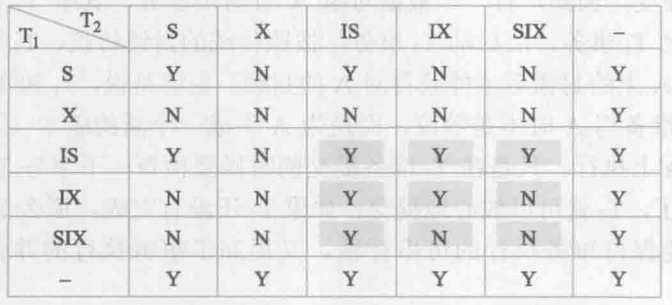

- [数据库编程](#chap8-数据库编程)
- [查询优化](#chap9-查询优化)
- [事务与数据恢复](#chap10-事务与数据恢复)
- [并发控制](#chap11-并发控制)

# Chap8 数据库编程

- [嵌入式SQL](#嵌入式sql)
- [过程化SQL](#过程化sql)
- [存储过程和函数](#存储过程和函数)
- [JDBC编程](#jdbc编程)
- [SQL注入](#sql注入)

## 嵌入式SQL

1. 嵌入式SQL：将SQL语句嵌入程序设计语言（C/C++，Java，称为(宿)主语言）中。
    - 处理过程：**预编译**。

2. 嵌入式SQL与主语言之间的通信：
    1. 向主语言传递SQL语句**执行状态信息**，使主语言能够**控制程序流程**（通过**SQLCA**实现）；
    2. 主语言向SQL语句提供参数（通过**主变量**实现）；
    3. 将SQL查询结果交给主语言处理（通过**主变量和游标**实现）。

## 过程化SQL

3. 过程化SQL：对SQL的扩展，使其增加了**过程化语句功能**。
    - 基本结构：**块**。块之间可以相互嵌套，每个块完成一个逻辑操作。
    - 块结构：（1）定义部分；（2）执行部分[条件控制/循环控制/异常处理部分]；

4. 变量、常量定义：**只能在基本块中使用**。当基本块执行结束，定义就不复存在。

5. 命名块与匿名块：
    - **命名块**：编译后保存在数据库中，可反复调用，运行速度快（如**存储过程（procedure）和函数（function）**）；
    - **匿名块**：每次执行时都需要编译，不会存储在数据库中，也不能在其他过程化SQL中调用。

## 存储过程和函数

6. 存储过程：由过程化SQL语句书写，经编译和优化后存储在数据库服务器中，使用时只要调用即可。
    - 优点：（1）效率高；（2）降低了客户机与服务器间的通信量；（3）方便实施业务规则。
    - 用户接口：（1）创建；（2）执行；（3）修改；（4）删除。

7. 函数与存储过程的异同：
    - 相同点：都是**持久性存储模块**；
    - 不同点：**函数必须指定返回类型**。

## JDBC编程

8. 主流数据库访问编程工具：**ODBC（Open Database Connectivity）**、**JDBC（Java Database Connectivity）**。

9. JDBC：JDBC API提供了一套**访问**任何**RDBMS**的**标准接口**。

## SQL注入

10. 预防：**必须使用参数化的传递方式，调用`setXXX()`函数进行变量绑定**。
    - 根本解决方案：**检查用户输入**，**转义特殊字符**。

# Chap9 查询优化

- [关系数据库系统的查询处理](#关系数据库系统的查询处理)
- [关系数据库系统的查询优化](#关系数据库系统的查询优化)
- [代数优化](#代数优化)
- [物理优化](#物理优化)

## 关系数据库系统的查询处理

1. 查询处理：将用户提交的查询语句转化为高效的**查询执行计划**。
    - 阶段：**查询分析**、**查询检查**、**查询优化**、**查询执行**。

2. 查询分析：词法分析与语法分析。

3. 查询检查：合法性检查、试图转换、**安全性检查（DAC/MAC定义的权限）**、完整性初步检查。
    - 一般使用**查询树（/语法分析树）**来表示扩展的关系代数表达式。

4. 查询优化：**代数优化**和**物理优化**。
    - 选择依据：基于规则/代价/语义。

5. 查询执行：由**代码生成器**生成依据优化器得到的执行计划的代码，加以执行并返回结果。

6. 选择操作的实现：（1）**全表扫描方法**；（2）**索引扫描方法**。

7. 连接操作的实现：（1）**嵌套循环算法**；（2）**排序-合并算法**；（3）**索引连接算法**；（4）**Hash Join算法**。
    - 适用条件：（1）适于**任何条件**；（2）仅适于**不等于**（'<>'）之外的条件；（3）是（1）的变种；（4）仅适于**等值连接**。

## 关系数据库系统的查询优化

8. 查询优化：通过某种**代价模型**计算出各种**查询执行策略**的**执行代价**，然后选择代价最小的执行方案。
    - 数据库执行代价：（1）**集中式数据库**主要考虑**I/O代价**；（2）**分布式数据库**则需要考虑**I/O**、**CPU**、**内存**及**通信**代价。

## 代数优化

9. 代数优化：**通过关系代数表达式的等价变换来提高查询效率**。

10. 选择与笛卡尔积的**交换律**：
    - $\sigma_F(E_1\times E_2)=\sigma_F(E_1)\times E_2$：$F$中涉及的属性都是$E_1$中的属性；
    - $\sigma_F(E_1\times E_2)=\sigma_{F_1}(E_1)\times\sigma_{F_2}(E_2)$：$F=F_1\wedge F_2$，且$F_i$仅涉及$E_i$的属性；
    - $\sigma_F(E_1\times E_2)=\sigma_{F_2}(\sigma_{F_1}(E_1)\times E_2)$：$F_1$仅涉及$E_1$中的属性，$F_2$涉及$E_1,E_2$的属性；
        - 使得**部分选择操作可在笛卡尔积前做**。

11. **查询树的启发式优化**：
    - **选择运算应尽可能先做**；
    - 把**投影运算和选择运算同时进行**；
    - 把**投影和其前或后的双目运算结合起来**；
    - 把某些**选择**同在它之前执行的**笛卡尔积**结合起来成为一个**连接运算**；
    - **找出公共子表达式**。

## 物理优化

12. 物理优化：**选择高效合理的操作算法或存取路径**，求得优化的查询计划。

13. 物理优化方法：（1）**基于规则的启发式优化**；（2）**基于代价估算的优化**；（3）二者结合。

# Chap10 事务与数据恢复

- [事务的基本概念](#事务的基本概念)
- [数据库恢复概述](#数据库恢复概述)
- [故障的种类](#故障的种类)
- [恢复的实现技术](#恢复的实现技术)
- [恢复策略](#恢复策略)
- [具有检查点的恢复技术](#具有检查点的恢复技术)
- [数据库镜像](#数据库镜像)

## 事务的基本概念

1. **事务**：用户定义的一个数据库操作序列，是一个**不可分割的工作单位**。
    - 事务与程序是两个概念。**事务是恢复和并发控制的基本单位**。
    - COMMIT/ROLLBACK。

2. 事务的**ACID**特性：（1）**原子性（A）**；（2）**一致性（C）**；（3）**隔离性（I）**；（4）**持续性（D）**。

## 数据库恢复概述

3. 数据库的恢复：由于**故障不可避免**，因此数据库管理系统必须具有**把数据库从错误状态恢复到某一已知的正确状态**（或称一致状态/完整状态）的功能，即数据库的恢复管理系统对故障的对策。

## 故障的种类

4. 故障的种类：（1）**事务内部故障**；（2）**系统故障**；（3）**介质故障**；（4）**计算机病毒**。

5. **事务内部故障**：如运算溢出、并发事务死锁、违反某些完整性规则等。
    - 恢复：**事务撤销（UNDO）**，即强行回滚（ROLLBACK）该事务。

6. **系统故障**（/软故障）：如系统断电、特定硬件错误、操作系统故障、数据库管理系统代码错误等。
    - 恢复：**强行撤销（UNDO）未完成事务**、**重做（REDO）已提交事务**。

7. **介质故障**（/硬故障）：如磁盘损坏、磁头碰撞、瞬时强磁场干扰等。

8. 恢复操作基本原理：**冗余**。

## 恢复的实现技术

9. 建立数据冗余：（1）**数据转储**；（2）**登记日志文件**。

10. 转储：DBA定期地将整个数据库文件复制到磁带、磁盘或其他存储介质上保存起来的过程。
    - **后备副本/后援副本**：即备用的数据文件。
    - 转储方法分类：（1）**静态/动态**转储；（2）**海量/增量**转储。

11. 静态/动态转储：
    - 静态转储：系统中**无运行事务时**进行的转储；
    - 动态转储：**与用户事务并发**的转储。
        - 利用动态转储副本进行故障恢复：需要建立**日志文件**。

12. 海量/增量转储：
    - 海量（/全量）转储：每次转储**全部数据库**；
    - 增量转储：每次只转储上次转储后**更新过的数据**。

13. 登记日志文件：记录事务对数据的更新操作的文件。
    - 格式：（1）以**记录**为单位；（2）以**数据块**为单位。
    - 用途：（1）进行**事务故障**恢复；（2）进行**系统故障**恢复；（3）协助后备副本进行介质故障恢复。
    - 原则：
        - 登记次序严格按照并发事务执行的时间次序。
        - **先写日志文件**，**后写数据库**。

## 恢复策略

14. 事务故障恢复步骤：
    1. **反向扫描日志文件**，找到故障事务的更新操作；
    2. 对该事务的更新操作**执行逆操作**；
    3. 继续反向扫描，寻找该事务其他更新操作，做同样处理；
    4. 如此处理，直至读到事务开始标记。

15. 系统故障恢复步骤：
    1. **正向扫描日志文件**，将故障前已提交的事务加入**重做队列**，将故障时未完成的事务加入**撤销队列**；
    2. 对撤销队列中的事务进行撤销（UNDO）处理；
        - **反向**扫描日志文件，对撤销事务每个更新操作执行逆操作。
    3. 对重做队列中的事务进行重做（REDO）处理。
        - **正向**扫描日志文件，对重做事务重新执行已登记的操作。

16. 介质故障恢复步骤：
    1. **重装数据库**，使之恢复到最近一次转储时的一致性状态；
    2. **装入有关日志文件副本**，重做（REDO）已完成的事务。
    - 介质故障恢复需要**数据库管理员介入**。

## 具有检查点的恢复技术

17. 检查点记录的内容：**检查点时刻**所有正在执行的事务清单，及这些事务最近的一个日志记录的地址。
    - 重新开始文件的内容：各个检查点记录在日志文件中的地址。

18. 动态维护日志文件的方法：**周期性**地**建立检查点**，**保存数据库状态**。
    1. 将当前**日志缓冲区**中的所有**日志记录**写入**磁盘**日志文件；
    2. 在日志文件中写入一个**检查点记录**；
    3. 将当前**数据缓冲区**中的所有**数据记录**写入**磁盘**数据库；
    4. 把记录点记录在日志文件中的**地址**写入一个**重新开始文件**。

## 数据库镜像

19. 数据库镜像：主从复制。用于有效地恢复**介质故障**。

# Chap11 并发控制

- [并发控制概述](#并发控制概述)
- [封锁](#封锁)
- [封锁协议](#封锁协议)
- [活锁和死锁](#活锁和死锁)
- [并发调度的可串行性](#并发调度的可串行性)
- [两段锁协议](#两段锁协议)
- [封锁的粒度](#封锁的粒度)

## 并发控制概述

1. 并发控制：为了**保证事务的隔离性和一致性**，数据库管理系统需要对并发操作进行正确调度。

2. 数据不一致性：（1）**丢失修改**；（2）**不可重复读**；（3）**读“脏”数据**。
    - 丢失修改：事务$T_1$执行**Update**，事务$T_2$执行**Update**；
    - 不可重复读：事务$T_1$执行**Read**，事务$T_2$执行**Update/Delete/Insert**；
    - 读“脏”数据：事务$T_1$执行**Rollback Update**，事务$T_2$执行**Read**。

3. 主要技术：（1）**封锁**；（2）时间戳；（3）乐观控制法；（4）多版本并发控制。

## 封锁

4. 基本封锁类型：（1）**排他锁（写锁）X锁**；（2）**共享锁（读锁）S锁**；

## 封锁协议

5. 三级封锁协议：
    - 一级封锁协议：事务$T$在**修改数据**$R$前**必须先对其加X锁**，**直到事务结束**才释放X锁。
        - **读数据不需要加锁**；
        - **仅能解决丢失修改问题**。
    - 二级封锁协议：在一级封锁协议基础上，事务$T$在**读取数据**$R$前**必须先对其加S锁**，**读完后**即可释放S锁。
        - **可防止丢失修改和读“脏”数据**；
        - 由于**读完即释放S锁**，因此**不能保证可重复读**。
    - 三级封锁协议：在一级封锁协议基础上，事务$T$在**读取数据**$R$前**必须先对其加S锁**，**直到事务结束**才释放S锁。
        - **可防止丢失修改、不可重复读和读“脏”数据**。

## 活锁和死锁

6. 避免活锁：采取**先来先服务**策略。

7. 死锁：
    - 产生条件：（1）请求互斥的共享资源；（2）非抢占；（3）持续占有一个资源同时请求另一资源；（4）循环等待。
    - 预防：（1）**一次封锁法**；（2）**顺序封锁法**；
    - 诊断：（1）**超时法**；（3）**等待图法**；
    - 解除：**选择一个处理死锁代价最小的事务**，将其撤消。

## 并发调度的可串行性

8. 可串行化调度：多个事务的并发执行时正确的，当且仅当其结果与**按某一次序串行地执行这些事务时的结果相同**，称这种调度策略为**可串行化调度**。
    - **可串行性**是并发事务正确调度的准测，一个并发调度是正确调度，当且仅当它是可串行化的。

9. 冲突：调度中一对连续的操作，若交换两者顺序，则设计的事务中至少有一个事务的行为会改变，则称这一对动作是**冲突**的。
    - 两个操作**可交换**当且仅当两个操作是**无冲突**的。
    - 可交换的操作：
        - **不同事务对同一元素的两个读操作**；
        - **不同事务对不同元素的任意两个操作**。
    - 不可交换的操作：
        - **同一事务的任意两个操作**；
        - **不同事务对同一元素的两个写操作**；
        - **不同事务对同一元素的一读一写操作**。

10. 冲突可串行化：一个调度$Sc$在**保证冲突操作的次序不变**的情况下，通过**交换两事务不冲突操作的次序**得到另一个调度$Sc^{\prime}$，若$Sc^{\prime}$是串行的，则称$Sc$是**冲突可串行化**的。
    - 冲突可串行化是可串行化的**充分非必要条件**。

## 两段锁协议

11. 两段锁协议：指所有事务必须**分两个阶段对数据项进行加锁和解锁**。
    - 通过**两段所协议**可以实现**并发调度可串行性**；
    - 事务遵循两段锁协议是可串行化调度的**充分非必要条件**。
    - 两个阶段：（1）**扩展阶段（获得封锁）**；（2）**收缩阶段（释放封锁）**。

12. 两段锁协议与死锁：
    - 预防死锁的**一次封锁法**遵循两段锁协议；
    - **遵循两段锁协议的事务可能发生死锁**。

## 封锁的粒度

13. 封锁粒度：封锁对象的大小。
    - 封锁对象：（1）**逻辑单元**（如属性值、集合、元组等）；（2）**物理单元**（如页、记录等）。

14. 封锁粒度、开销与并发度：封锁**粒度**越大，并发度**越小**，系统**开销**越小。

15. 多粒度树：以**树形结构表示多级封锁粒度**。根结点为整个数据库，表示最大的数据粒度。叶结点表示最小的数据粒度（如元组）。

16. 多粒度封锁协议：允许多粒度树中的每个结点被独立地加锁。
    - **显示加锁**：直接加到数据对象上的封锁；
    - **隐式加锁**：由于上级结点加锁而使该对象上锁。

17. 意向锁：对一个结点加意向锁，则说明该结点的**下层结点**正在被加锁。
    - 避免了低效的隐式锁检查。
    - 分类：（1）**IS锁**（后裔结点拟加S锁）；（2）**IX锁**（后裔结点拟加X锁）；（3）**SIX锁**（加S锁及IX锁）。

18. 锁相容矩阵：

19. 锁强度：**X>SIX>S=IX>IS**。
