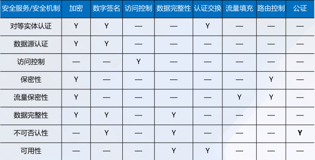
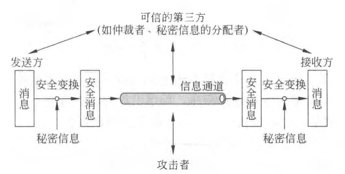
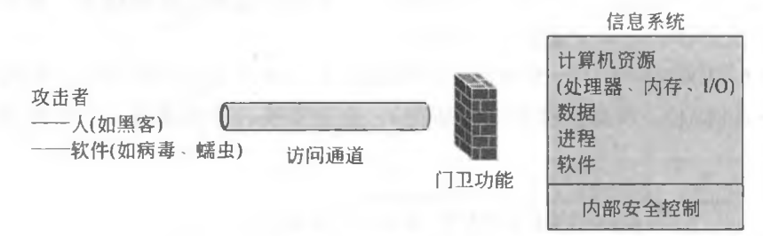
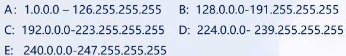
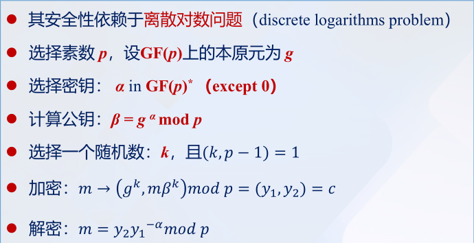
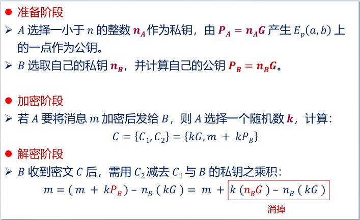
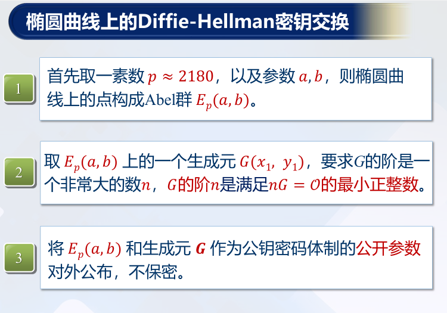
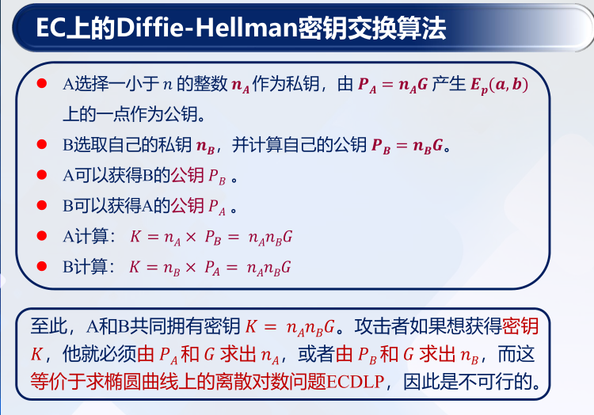

# Emphasis

## 第1章 引言

1. 信息安全的四个目标：

答：<u>保密性、完整性、可用性、合法使用</u>。

2. 信息系统中常见的威胁：

答：

基本威胁有<u>信息泄露、完整性破坏、拒绝服务、非法使用</u>；

主要可实现威胁有<u>渗入威胁、植入威胁</u>，前者包括<u>假冒、旁路控制、授权侵犯</u>，后者包括<u>特洛伊木马、陷门</u>；

潜在威胁有<u?>网络窃听、流量分析、操作人员不慎导致信息泄露、媒体废弃物导致信息泄露</u>。

3. 什么是安全策略？安全策略分几个等级？

答：

安全策略指<u>某个安全域内施加给所有与安全相关活动的一套规则</u>。

安全策略分为<u>安全策略目标、机构安全策略、系统安全策略</u>三个等级。

4. 什么是访问控制策略？它有哪些类型？这些访问控制策略有何区别？

答：

访问控制策略隶属于<u>系统级安全策略</u>，其迫使计算机系统和网络自动地执行<u>授权</u>。

访问控制策略分为<u>强制访问策略、自主访问策略</u>，也分为<u>基于角色的访问控制、基于任务的访问控制、基于对象的访问控制</u>。

5. 什么是安全域？划分安全域原则是什么？如何划分安全域？

答：安全域指<u>属于某个组织机构的一系列处理进程和通信资源</u>。划分安全域的原则是<u>最小权限原则，或最小知悉原则</u>。

6. 什么是授权？用户授权有何作用？常用于哪些应用场景？

答：授权是安全策略的一个基本组成部分，它指<u>主体（用户、终端、程序等）</u>对<u>客体（数据、程序等）</u>的支配权限，规定了谁可以对什么做些什么。

7. 安全攻击分为几大类？常见的攻击形式有哪些？

答：

安全攻击可分为<u>被动攻击、主动攻击</u>，前者包括<u>信息泄露、流量分析</u>，后者包括<u>伪装、重放、消息篡改、拒绝服务</u>。

常见形式有<u>口令窃取、欺骗攻击、缺陷和后门攻击、认证失效、协议缺陷、信息泄露、指数攻击、拒绝服务攻击</u>。

8. 熟记X.800标准中的5类安全服务和8种特定安全机制，并简述安全服务与安全机制之间的关系。

答：

5类安全服务为<u>认证、访问控制、数据保密性、数据完整性、不可否认性</u>。

8种安全机制为<u>加密、数字签名、访问控制、数据完整性、认证交换、流量填充、路由控制、公证</u>。

一类安全服务由一种或多种安全机制实现。

     
    <b>图1 安全服务与安全机制的关系</b>

9. 理解并画出网络安全模型和网络访问模型。

答：

    
     
    <b>图2 网络安全模型与网络访问安全模型</b>

## 第2章 计算机网络基础

1. 熟记OSI的七层参考模型、TCP/IP的四层模型。

答：

OSI七层参考模型为<u>物理层、数据链路层、网络层、传输层、会话层、表示层、应用层</u>。

TCP/IP的四层模型为<u>网络接口层、网络层、传输层、应用层</u>。

2. 什么是面向连接的服务？什么是无连接的服务？

答：面向连接的服务（如TCP）指通信双方首先需要建立一条信道，方可进行数据传输；无连接的服务（如IP、UDP）指双方无需事先建立信道，数据分组无序传输。

3. 必须知道IPv4及IPv6地址的格式及长度。

答：IPv4为32位，IPv6为128位。

4. 必须知道MAC地址的长度。

答：MAC地址为48位。

5. IP地址与MAC地址转换靠哪个网络协议？

答：依靠ARP协议（OSI模型中属于数据链路层，TCP/IP模型中属于网络层）。

6. IPv4的地址分哪几类？给定一个IP地址，要能够分析判断出该地址属于哪一类地址。

答：IPv4的地址分为A、B、C、D、E五类。给定一个IP，根据其点分十进制表示，可判断属于哪一类地址：

     
    <b>图3 判断IP地址类别的方法</b>

7. 给定一个IPv4地址和子网掩码，要求能够计算出网络地址。

答：网络地址等于IPv4地址与子网掩码的逐位与。

8. 熟悉CIDR的表示方法。给定一个CIDR地址，能够写出该地址的表示范围。如一个CIDR地址为：128.14.32.0/20，它表示的地址块范围和子网掩码是什么？

答：CIDR地址的表示方法为<u>IP地址/net-id位数</u>。

CIDR地址128.14.32.0/20的子网掩码为255.255.240.0，地址块范围为128.14.32.1-128.14.47.254。

9. 什么是“端口号”？“端口号”在网络通信中起什么作用？

答：

端口用于标识一台计算机中特定<u>进程</u>所提供的服务。

端口号在网络通信中起到的作用为区分同一台设备上不同的应用程序，为其提供端对端的数据通道连接。

## 第3章 Internet协议的安全性

1. 熟记http/ftp/telnet/pop3/smtp/imap/ssh/dns等常用通信协议的功能。

答：

|  协议     |   功能        |
|  :----    |   :----      | 
| HTTP(TCP 80)        |  超文本传输协议是一个<u>客户端</u>和<u>服务器端</u>请求和应答的标准，是互联网上应用最广泛的一种网络协议         |
| FTP(TCP 20/21)       |  文本传输协议是Internet文件传送的基础         |
| Telnet(TCP 23)    |  远程登陆协议是Internet远程登陆服务的标准协议和主要方法         |
| POP3(TCP 110)      |  邮局协议是一个邮件接收协议         |
| SMTP(TCP 25)      |  简单邮件传输协议用于发送邮件         |
| IMAP4(TCP 143,993)      |  消息访问协议是一个邮件获取协议         |
| SSH(TCP 22)       |  安全壳协议是一种在不安全网络上建立安全远程登陆或其他安全网络服务的协议         |
| DNS(TCP 53)       |  域名系统协议用于实现域名与IP地址之间的映射         |

2. 熟记一些常用网络协议的端口号。

答：如前。

3. 网际层协议有哪些？传输层协议有哪些？应用层协议有哪些？

答：

TCP/IP网际层协议主要包括：<u>IP协议（网际协议）、ICMP协议（控制报文协议）、ARP协议（地址解析协议）、DHCP协议（动态主机配置协议）、RARP协议（反向地址解析协议）</u>。

传输层协议主要包括：<u>TCP协议、UDP协议</u>。其他还包括UDP-Lite协议、SCTP协议（流控制传输协议）、DCCP协议（数据拥塞控制协议）。

应用层协议包括：<u>DNS、HTTP、TLS/SSL、SMTP、POP、IMAP、MIME、Telnet、SSH、FTP</u>等。

4. 为什么要进行网络地址转换（NAT）？

答：网络地址转换（NAT）的主要目的是为了<u>节省公共IP地址和提高网络的安全性</u>。通过NAT，一个私有网络中的多台设备可以共享一个或多个公共IP地址，从而减少对公共IP地址的需求。此外，NAT可以隐藏内部网络的拓扑结构和设备信息，增加了网络的安全性，防止外部攻击者直接访问内部设备。

5. ARP协议的作用是什么？

答：地址解析协议（ARP）的作用是<u>将IP地址转换为MAC地址</u>。在一个局域网中，当一台设备需要发送数据到另一台设备时，它需要知道目标设备的MAC地址。ARP协议通过广播请求IP地址对应的MAC地址，并接收目标设备的回应来完成这一转换过程，从而使数据能够正确传输到目标设备。

6. 为什么UDP比TCP协议更加容易遭到攻击？

答：UDP比TCP协议更加容易遭到攻击的主要原因是<u>UDP是无连接的协议，没有建立连接的过程，也没有状态追踪机制</u>。这使得UDP更容易被用来进行<u>DDoS攻击（如UDP洪泛攻击）</u>，因为攻击者可以轻易地伪造源地址并发送大量的UDP数据包，而无需担心连接建立和维护。此外，UDP<u>缺乏TCP的拥塞控制和流量控制机制，使其更容易导致网络拥塞和资源耗尽</u>。

7. IMAP协议与POP3协议相比，它的安全性有哪些提升？

答：

- **状态同步**：IMAP允许在<u>多个客户端之间同步邮件状态</u>，使得用户可以在不同设备上看到相同的邮件状态，这有助于防止邮件在多个客户端之间的不一致问题。

- **访问控制**：IMAP支持服务器端的<u>访问控制</u>（如通过防火墙），可以限制用户对某些邮件文件夹的访问权限。

- **加密传输**：IMAP比POP3更常<u>与TLS/SSL加密结合使用</u>，从而确保邮件在传输过程中的机密性和完整性，防止窃听和篡改。

- **邮件管理**：IMAP支持<u>在服务器上直接管理邮件</u>，包括创建、删除、移动邮件等操作，从而减少邮件在客户端和服务器之间的传输，提高了整体的安全性和效率。

8. SSH协议与Telnet协议相比，它的安全性有哪些提升？

答：

- **加密传输**：SSH使用<u>加密技术确保数据在传输过程中不可见</u>，而Telnet则是以明文形式传输数据，容易被攻击者直接截获。

- **身份验证**：SSH支持<u>多种身份验证方式</u>，如密码认证、公钥认证等，而Telnet只支持简单的明文密码认证，容易被攻击者破解。

- **保护远程登录**：通过加密和认证机制，SSH能够<u>有效防止中间人攻击、会话劫持</u>等网络攻击。

9. 什么是ICMP重定向攻击？如何防止此类攻击？

答：ICMP重定向攻击是指攻击者通过<u>伪造ICMP重定向消息</u>，引导受害者的流量经过攻击者控制的路径，从而进行<u>数据截获、劫持、拒绝服务</u>等攻击。防止此类攻击的策略有：

- **禁用ICMP重定向**：在网络设备和操作系统上<u>禁用ICMP重定向功能</u>。

- **过滤ICMP消息**：在防火墙上过滤或限制ICMP重定向消息，<u>确保只有可信的网络设备可以发送ICMP重定向</u>。如重定向消息应该仅由产生消息的主机或路由器执行，网管员不应使用ICMP创建通往目的地的新路由。

- **网络监控和检测**：使用入侵检测系统（IDS）和入侵防御系统（IPS）<u>监控网络中的异常ICMP消息，并及时响应和处理</u>。

10. 在网络中，为什么不能仅仅靠识别数据包的IP地址，来判断一个数据包就是来自该IP地址的主机？

答：

在网络中，仅靠识别数据包的IP地址来判断一个数据包的来源是不可靠的。首先，攻击者可以通过<u>伪造IP地址发送数据包，进行IP地址欺骗（IP spoofing）</u>，从而掩盖其真实身份，绕过网络安全措施。

此外，NAT等技术也使得<u>多个设备可以共享一个公共IP地址</u>，进一步增加了判断数据包真实来源的难度。因此，必须结合其他方法（如TCP序列号、加密认证等）来验证数据包的真实性和来源。

## 第4章 单钥密码体制

1.  按照对明文消息的处理方式不同，单钥体制可分为哪两类？

答：可分为<u>流密码和分组密码</u>。

流密码对数据<u>逐比特</u>加密，即数据流与密钥流逐比特进行异或(XOR)运算；

分组密码对数据<u>分组</u>进行密文变换。

2.  古典密码中的两个常用的变换是什么？

答：常用的两个变换为<u>置换和代换</u>。置换指明文字母保持不变、但顺序被打乱；代换指明文字母被替换、但顺序不变。

3.  什么是理论上安全？什么是计算上安全？理论上安全的密码算法有几个？理论上安全的密码是什么密码？

- **理论上安全**：一种密码算法如果在任何情况下都无法被破译，不论攻击者拥有多少计算资源和时间，这种安全性被称为理论上安全。理想情况下，这意味着密码系统是无法攻破的。

- **计算上安全**：一种密码算法如果在实际情况下无法在合理的时间内被破译，即使攻击者拥有大量计算资源，但仍需要花费不切实际的时间和计算能力。

理论上安全的密码算法有1个，即<u>一次一密（One-Time Pad, OTP）</u>。

4.  什么是同步流密码、自同步流密码？流密码的安全性取决于什么？

答：

- **同步流密码**：密钥流生成器状态<u>与明文无关</u>，即对于明文而言，该加密变换是<u>无记忆的</u>。
    - 优点为<u>无差错传播</u>；缺点为<u>对失步敏感</u>。

- **自同步流密码**：密钥流生成器状态与<u>（前序）明文和初始密钥有关</u>。
    - 优点为<u>具有自同步能力</u>；缺点为<u>传输过程一位的出错会影响后续密钥正确性</u>。

流密码的安全性取决于<u>伪随机数的强度</u>。

5.  DES分组长度、密钥长度、轮数是多少？1轮加密包括哪些变换？DES中的非线性变换是什么变换？

答：

|  加密体制     |   分组长度    |  密钥长度       |    轮数    |   单轮加密变换   |   非线性变换      |
|  :----           |   :----       |    :----      |   :----      |   :----       |   :----       |
|    **DES**           |   64          |    56       |     16     |   E盒置换、轮密钥加、 S盒代换、P盒置换       |    S盒代换       |
|    **AES**           |   128         |    128,192,256        |   10,12,14    |   字节代换、行移位、 列混淆、轮密钥加     |    字节代换    |
|    **SM4**           |   128         |    128       |    32      |   轮密钥加、非线性变换$\tau$、 线性变换$L$      |   $\tau$（S盒代换）     |

6.  AES分组长度、密钥长度、轮数是多少？1轮加密包括哪些变换？AES中包含的非线性变换是什么变换？

答：同T5.

7.  加密轮数是否越多越好？密钥是否越长越好？将2个算法串联对数据加密，是否一定更安全？

答：

- **加密轮数是否越多越好**：并不是越多越好。轮数的增加并不一定增强安全性（考虑加密体制的幂等性），但同时一定会增加了计算开销。轮数应该根据算法设计的安全性需求来确定，达到既安全又高效的平衡。

- **密钥是否越长越好**：密钥越长，安全性越高，但也会增加存储、通信和计算资源开销。实际使用中，需要根据安全需求和性能考虑选择合适的密钥长度。

- **将两个算法串联加密是否一定更安全**：不一定。串联加密有时会提高安全性，但也可能引入新的弱点。两个算法的组合需要经过严密的分析和验证，确保不会因为算法之间的交互而导致整体安全性降低。

8.  分组密码的5种工作模式是什么？能画出5种工作模式的原理框图。

答：ECB、CBC、CFB、OFB、CTR。

9.  分析5种加密模式中，哪些加密模式没有误码扩展？哪些有误码扩展？如果有误码扩展，会影响多少个分组？

答：

- **没有误码扩展的模式**：计算器模式（CTR）、输出反馈模式（OFB）。

- **有误码扩展的模式**：电子密码本模式（ECB）、密码分组链接模式（CBC）、密码反馈模式（CFB）。

- **误码扩展的影响**：
    - **ECB模式**：当前分组。
    - **CBC模式**：当前分组和下一个分组。
    - **CFB模式**：影响当前分组和接下来的分组，具体数量取决于反馈长度（$\lceil\dfrac{n}{s}\rceil$）。

10.  了解中国商用分组密码算法SM4，知道它的分组长度、密钥长度和加密轮数。

答：同T5。

**补充**：

11.  扩散和混淆：

- **扩散**： 单个输入比特的影响扩散到多个输出比特；

- **混淆**：密钥和密文之间构成复杂关系。

12.  祖冲之密码算法标准：

- **祖冲之密码算法（ZUC）**：用于产生密钥序列。

- **128-EEA3**：基于ZUC的机密性算法。

- **128-EIA3**：基于ZUC的完整性保护算法。

## 第5章 双钥密码体制

1.  双钥密码体制是基于数学难题构造的，请列举出目前存在的数学难题。用双钥体制加密时采用谁的公钥？解密时采用谁的私钥？

答：多项式求根，大整数分解，离散对数，背包问题，DH问题，二次剩余问题，模$n$的平方根问题。公钥加密、私钥解密。

2.  RSA是基于何种数学难题构造的？Diffie-Hellman是基于何种数学难题构造的？

答：分别基于大整数分解和离散对数困难问题。

3.  请写出RSA加密和解密的数学表达式，并指出什么是公钥，什么是私钥？并能做简单的加密和解密计算。

答：公私钥对为$(e,d)$，模数为$n$，满足$ed\equiv1\;(\text{mod}\;\varphi(n))$。对明文$m$加密得到密文$c$：$c\equiv m^e\;(\text{mod}\;n)$；对密文$c$解密得到明文$m$：$m\equiv c^d\;(\text{mod}\;n)$。

4.  RSA在各种参数选择上有哪些原则和限制？为什么？

答：

- 模数$n$足够大，$p,q$为大素数；
- $p\pm1,q\pm1$要有大素因子；
    - $p,q$为<u>强素数</u>。
- $p,q$之差要大；
    - 防止通过<u>开方</u>试验出$p,q$值。
- $1<e<\varphi(n), \gcd(e,\varphi(n))=1$；
- $e$不应过小；
    - 防止<u>低加密指数攻击</u>。
- $d>n^{1/4}$；
    - 防止<u>维纳攻击</u>。

5.  写出ElGamal密码体制是基于何种数学难题？请写出它的加密表达式和解密表达式？

答：

     
    <b>图4 ElGamal密码体制</b>

6.  ECC公钥密码基于何种数学难题？写出ECC公钥密码体制的加密表达式和解密表达式。

答：

     
    <b>图5 ECC公钥密码体制</b>

7.  写出基于ECC的Diffie-Hellman密钥交换协议。

答：

    
     
    <b>图6 Diffie-Hellman密钥交换协议</b>

8.  RSA和ECC公钥密码算法在加密、解密速度上有何差异？请查阅资料，比较它们分别采用硬件和软件实现时的加密和解密速度。

答：

|  ECC密钥长度（/bits）     |   RSA密钥长度（/bits）    |  $10^n$ MIPS年    |
|    :----         |   :----         |    :----   |
|    160           |   1024          |    12      |
|    320           |   5120          |    36      |
|    600           |   21000         |    78      |
|    1200          |   120000        |    168     |

9.  对公钥密码的攻击有哪些常见的攻击方式？它们各有什么特点？

答：

- <u>**选择明文攻击（CPA）**</u>。攻击者选择明文消息并得到加密服务，产生相应的密文，攻击者通过得到的明密文对来降低目标密码体制的安全性。

- <u>**选择密文攻击（CCA）**</u>。攻击者选择密文消息并得到解密服务，产生相应的明文。攻击者用所得到的明密文对来降低目标密码体制的安全性。在解密服务停止后，即在得到目标密文之后，解密服务立即停止。如果攻击者能够从“目标密文”中得到保密明文的信息，则就说攻击是成功的。

- <u>**适应性选择密文攻击（CCA2）**</u>。这是一种CCA，而且除了对“目标密文”解密外，永远能够得到解密服务。

10.  了解中国的商用公钥密码算法SM2。

答：

SM2是一组基于<u>椭圆曲线</u>的公钥密码算法，包含<u>加解密算法、数字签名算法和密钥交换协议</u>，采取了<u>检错措施</u>，提高了系统的数据完整性和可靠性。SM2的公钥长度为512-bit、私钥长度为256-bit、签名长度为256-bit。

## 第6章 消息认证与杂凑函数

1.  请说明Hash函数与加密函数有何不同？

答：

- **Hash函数**: 将任意长度的输入映射为固定长度的输出，具有不可逆性，主要用于数据完整性校验。

- **加密函数**: 将明文转换为密文，可以逆操作恢复明文，主要用于保密性。

2.  杂凑函数具有哪些性质？

答：<u>单向性、任意长输入定长输出、抗原象攻击、抗碰撞攻击</u>。

3.  什么是消息认证码MAC？如何构造？

答：MAC是有<u>密钥</u>参与杂凑运算的算法。构造方法: 常见的有基于Hash函数的HMAC，和基于分组加密的CBC-MAC、CMAC。

4.  在不知道密钥的情况下，如何对MAC算法成功实施攻击？（167页）

答：

5.  如何采用Hash函数和分组加密算法构造MAC？

6.  什么是消息检测码（或消息摘要）MDC？简述MDC与MAC的异同。

7.  熟悉迭代杂凑函数的构造方法。

8.  MD5的明文输入分组长度、字长、输出长度是多少位？

9.  SHA-1的明文输入分组长度、字长、输出长度是多少位？

10.  掌握应用杂凑函数的基本方式，熟悉图6-1、6-2、6-5、6-6所能够提供的安全功能。

11.  熟悉中国商用杂凑函数SM3的构造。

12.  掌握迭代杂凑函数的构造方法。

## 第7章 数字签名

1.  数字签名应该具有哪些性质？

2.  数字签名可以分为哪几类？

3.  RSA签名是基于何种数学难题？

4.  ElGamal签名是基于何种数学难题？请写出ElGamal的签名方程。

5.  Schnorr签名与ElGamal签名有何不同？请比较两者的异同。

6.  请写出DSS的签名方程，并比较它与ElGamal、Schnorr的异同。

7.  在以上三种签名方案中，每次签名时，用户都要选择一个随机数k。若将随机数$k$替换成为常数，会出现什么安全问题？请加以分析。

8.  Diffie-Hellman能用来做数字签名吗？

9.  单钥体制能用来做数字签名吗？

10.  试比较数字签名在密钥的使用上，与公钥加密算法存在的区别。

11.  请列举具有特殊功能的数字签名体制有哪些？它们各有什么用途？

12.  了解中国商用数字签名算法SM2。

## 第8章 密码协议

1.  构成协议的三个主要特征（含义）是什么？

2.  什么是仲裁协议？什么是裁决协议？什么是自执行协议？

3.  如果按照密码协议的功能分类，密码协议可以分为哪几类？

4.  什么是中间人攻击？如何对Diffie-Hellman协议进行中间人攻击？请用画图分析对Diffie-Hellman协议进行中间人攻击的详细过程。

5.  DH协议不能抵抗中间人攻击的原因是什么？如何改造DH协议可以使其抵抗中间人攻击？

6.  Diffie-Hellman能用来做数字签名吗？

7.  掌握大嘴青蛙协议、Yahalom、Kerberos协议安全协议设计的思想。

8.  请画图分析第218页的SKID协议为什么不能抵抗中间人攻击？如何改造这个协议，可以有效抵抗中间人攻击？

9.  对密码协议的攻击方法有哪些？

10.  密码协议的安全性分析的常用方法有哪些？
