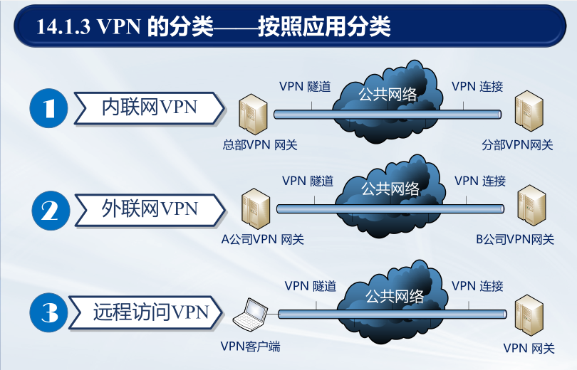
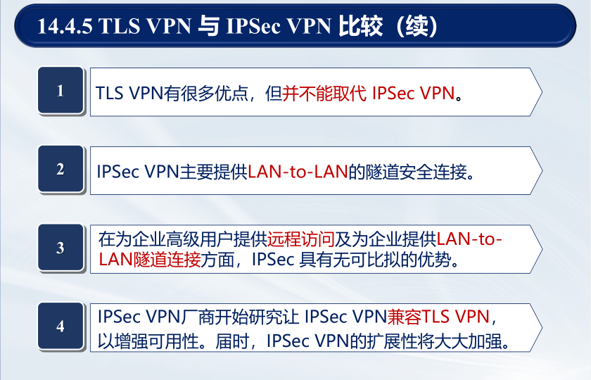

# Emphasis

## 第1章 引言

1. <span style="background-color:yellow">信息安全的四个目标：

答：<u>保密性、完整性、可用性、合法使用</u>。


2. <span style="background-color:yellow">信息系统中常见的威胁：

答：

基本威胁有<u>信息泄露、完整性破坏、拒绝服务、非法使用</u>；

主要可实现威胁有<u>渗入威胁、植入威胁</u>，前者包括<u>假冒、旁路控制、授权侵犯</u>，后者包括<u>特洛伊木马、陷门</u>；

潜在威胁有<u?>网络窃听、流量分析、操作人员不慎导致信息泄露、媒体废弃物导致信息泄露</u>。


3. <span style="background-color:yellow">什么是安全策略？安全策略分几个等级？

答：

安全策略指<u>某个安全域内施加给所有与安全相关活动的一套规则</u>。

安全策略分为<u>安全策略目标、机构安全策略、系统安全策略</u>三个等级。


4. <span style="background-color:yellow">什么是访问控制策略？它有哪些类型？这些访问控制策略有何区别？

答：

访问控制策略隶属于<u>系统级安全策略</u>，其迫使计算机系统和网络自动地执行<u>授权</u>。

访问控制策略分为<u>强制访问策略、自主访问策略</u>，也分为<u>基于角色的访问控制、基于任务的访问控制、基于对象的访问控制</u>。


5. <span style="background-color:yellow">什么是安全域？划分安全域原则是什么？如何划分安全域？

答：安全域指<u>属于某个组织机构的一系列处理进程和通信资源</u>。划分安全域的原则是<u>最小权限原则，或最小知悉原则</u>。


6. <span style="background-color:yellow">什么是授权？用户授权有何作用？常用于哪些应用场景？

答：授权是安全策略的一个基本组成部分，它指<u>主体（用户、终端、程序等）</u>对<u>客体（数据、程序等）</u>的支配权限，规定了谁可以对什么做些什么。


7. <span style="background-color:yellow">安全攻击分为几大类？常见的攻击形式有哪些？

答：

安全攻击可分为<u>被动攻击、主动攻击</u>，前者包括<u>信息泄露、流量分析</u>，后者包括<u>伪装、重放、消息篡改、拒绝服务</u>。

常见形式有<u>口令窃取、欺骗攻击、缺陷和后门攻击、认证失效、协议缺陷、信息泄露、指数攻击、拒绝服务攻击</u>。

8. <span style="background-color:yellow">熟记X.800标准中的5类安全服务和8种特定安全机制，并简述安全服务与安全机制之间的关系。

答：

5类安全服务为<u>认证、访问控制、数据保密性、数据完整性、不可否认性</u>。

8种安全机制为<u>加密、数字签名、访问控制、数据完整性、认证交换、流量填充、路由控制、公证</u>。

一类安全服务由一种或多种安全机制实现。

<p align="center">
    <br>
    <b>图1 安全服务与安全机制的关系</b>
</p>


9. <span style="background-color:yellow">理解并画出网络安全模型和网络访问模型。

答：

<p align="center">
    
    <br>
    <b>图2 网络安全模型与网络访问安全模型</b>
</p>


## 第2章 计算机网络基础

1. <span style="background-color:yellow">熟记OSI的七层参考模型、TCP/IP的四层模型。

答：

OSI七层参考模型为<u>物理层、数据链路层、网络层、传输层、会话层、表示层、应用层</u>。

TCP/IP的四层模型为<u>网络接口层、网络层、传输层、应用层</u>。


2. <span style="background-color:yellow">什么是面向连接的服务？什么是无连接的服务？

答：面向连接的服务（如TCP）指通信双方首先需要建立一条信道，方可进行数据传输；无连接的服务（如IP、UDP）指双方无需事先建立信道，数据分组无序传输。


3. <span style="background-color:yellow">必须知道IPv4及IPv6地址的格式及长度。

答：IPv4为32位，IPv6为128位。


4. <span style="background-color:yellow">必须知道MAC地址的长度。

答：MAC地址为48位。


5. <span style="background-color:yellow">IP地址与MAC地址转换靠哪个网络协议？

答：依靠ARP协议（OSI模型中属于数据链路层，TCP/IP模型中属于网络层）。


6. <span style="background-color:yellow">IPv4的地址分哪几类？给定一个IP地址，要能够分析判断出该地址属于哪一类地址。

答：IPv4的地址分为A、B、C、D、E五类。给定一个IP，根据其点分十进制表示，可判断属于哪一类地址：

<p align="center">
    <br>
    <b>图3 判断IP地址类别的方法</b>
</p>


7. <span style="background-color:yellow">给定一个IPv4地址和子网掩码，要求能够计算出网络地址。

答：网络地址等于IPv4地址与子网掩码的逐位与。


8. <span style="background-color:yellow">熟悉CIDR的表示方法。给定一个CIDR地址，能够写出该地址的表示范围。如一个CIDR地址为：128.14.32.0/20，它表示的地址块范围和子网掩码是什么？

答：CIDR地址的表示方法为<u>IP地址/net-id位数</u>。

CIDR地址128.14.32.0/20的子网掩码为255.255.240.0，地址块范围为128.14.32.1-128.14.47.254。


9. <span style="background-color:yellow">什么是“端口号”？“端口号”在网络通信中起什么作用？

答：

端口用于标识一台计算机中特定<u>进程</u>所提供的服务。

端口号在网络通信中起到的作用为区分同一台设备上不同的应用程序，为其提供端对端的数据通道连接。


## 第3章 Internet协议的安全性

1. <span style="background-color:yellow">熟记http/ftp/telnet/pop3/smtp/imap/ssh/dns等常用通信协议的功能。

答：

|  协议     |   功能        |
|  :----    |   :----      | 
| HTTP(TCP 80)        |  超文本传输协议是一个<u>客户端</u>和<u>服务器端</u>请求和应答的标准，是互联网上应用最广泛的一种网络协议         |
| FTP(TCP 20/21)       |  文本传输协议是Internet文件传送的基础         |
| Telnet(TCP 23)    |  远程登陆协议是Internet远程登陆服务的标准协议和主要方法         |
| POP3(TCP 110)      |  邮局协议是一个邮件接收协议         |
| SMTP(TCP 25)      |  简单邮件传输协议用于发送邮件         |
| IMAP4(TCP 143,993)      |  消息访问协议是一个邮件获取协议         |
| SSH(TCP 22)       |  安全壳协议是一种在不安全网络上建立安全远程登陆或其他安全网络服务的协议         |
| DNS(TCP 53)       |  域名系统协议用于实现域名与IP地址之间的映射         |


2. <span style="background-color:yellow">熟记一些常用网络协议的端口号。

答：如前。


3. <span style="background-color:yellow">网际层协议有哪些？传输层协议有哪些？应用层协议有哪些？

答：

TCP/IP网际层协议主要包括：<u>IP协议（网际协议）、ICMP协议（控制报文协议）、ARP协议（地址解析协议）、DHCP协议（动态主机配置协议）、RARP协议（反向地址解析协议）</u>。

传输层协议主要包括：<u>TCP协议、UDP协议</u>。其他还包括UDP-Lite协议、SCTP协议（流控制传输协议）、DCCP协议（数据拥塞控制协议）。

应用层协议包括：<u>DNS、HTTP、TLS/SSL、SMTP、POP、IMAP、MIME、Telnet、SSH、FTP</u>等。


4. <span style="background-color:yellow">为什么要进行网络地址转换（NAT）？

答：网络地址转换（NAT）的主要目的是为了<u>节省公共IP地址和提高网络的安全性</u>。通过NAT，一个私有网络中的多台设备可以共享一个或多个公共IP地址，从而减少对公共IP地址的需求。此外，NAT可以隐藏内部网络的拓扑结构和设备信息，增加了网络的安全性，防止外部攻击者直接访问内部设备。


5. <span style="background-color:yellow">ARP协议的作用是什么？

答：地址解析协议（ARP）的作用是<u>将IP地址转换为MAC地址</u>。在一个局域网中，当一台设备需要发送数据到另一台设备时，它需要知道目标设备的MAC地址。ARP协议通过广播请求IP地址对应的MAC地址，并接收目标设备的回应来完成这一转换过程，从而使数据能够正确传输到目标设备。


6. <span style="background-color:yellow">为什么UDP比TCP协议更加容易遭到攻击？

答：UDP比TCP协议更加容易遭到攻击的主要原因是<u>UDP是无连接的协议，没有建立连接的过程，也没有状态追踪机制</u>。这使得UDP更容易被用来进行<u>DDoS攻击（如UDP洪泛攻击）</u>，因为攻击者可以轻易地伪造源地址并发送大量的UDP数据包，而无需担心连接建立和维护。此外，UDP<u>缺乏TCP的拥塞控制和流量控制机制，使其更容易导致网络拥塞和资源耗尽</u>。


7. <span style="background-color:yellow">IMAP协议与POP3协议相比，它的安全性有哪些提升？

答：

- **状态同步**：IMAP允许在<u>多个客户端之间同步邮件状态</u>，使得用户可以在不同设备上看到相同的邮件状态，这有助于防止邮件在多个客户端之间的不一致问题。

- **访问控制**：IMAP支持服务器端的<u>访问控制</u>（如通过防火墙），可以限制用户对某些邮件文件夹的访问权限。

- **加密传输**：IMAP比POP3更常<u>与TLS/SSL加密结合使用</u>，从而确保邮件在传输过程中的机密性和完整性，防止窃听和篡改。

- **邮件管理**：IMAP支持<u>在服务器上直接管理邮件</u>，包括创建、删除、移动邮件等操作，从而减少邮件在客户端和服务器之间的传输，提高了整体的安全性和效率。

8. <span style="background-color:yellow">SSH协议与Telnet协议相比，它的安全性有哪些提升？

答：

- **加密传输**：SSH使用<u>加密技术确保数据在传输过程中不可见</u>，而Telnet则是以明文形式传输数据，容易被攻击者直接截获。

- **身份验证**：SSH支持<u>多种身份验证方式</u>，如密码认证、公钥认证等，而Telnet只支持简单的明文密码认证，容易被攻击者破解。

- **保护远程登录**：通过加密和认证机制，SSH能够<u>有效防止中间人攻击、会话劫持</u>等网络攻击。


9. <span style="background-color:yellow">什么是ICMP重定向攻击？如何防止此类攻击？

答：ICMP重定向攻击是指攻击者通过<u>伪造ICMP重定向消息</u>，引导受害者的流量经过攻击者控制的路径，从而进行<u>数据截获、劫持、拒绝服务</u>等攻击。防止此类攻击的策略有：

- **禁用ICMP重定向**：在网络设备和操作系统上<u>禁用ICMP重定向功能</u>。

- **过滤ICMP消息**：在防火墙上过滤或限制ICMP重定向消息，<u>确保只有可信的网络设备可以发送ICMP重定向</u>。如重定向消息应该仅由产生消息的主机或路由器执行，网管员不应使用ICMP创建通往目的地的新路由。

- **网络监控和检测**：使用入侵检测系统（IDS）和入侵防御系统（IPS）<u>监控网络中的异常ICMP消息，并及时响应和处理</u>。


10. <span style="background-color:yellow">在网络中，为什么不能仅仅靠识别数据包的IP地址，来判断一个数据包就是来自该IP地址的主机？

答：

在网络中，仅靠识别数据包的IP地址来判断一个数据包的来源是不可靠的。首先，攻击者可以通过<u>伪造IP地址发送数据包，进行IP地址欺骗（IP spoofing）</u>，从而掩盖其真实身份，绕过网络安全措施。

此外，NAT等技术也使得<u>多个设备可以共享一个公共IP地址</u>，进一步增加了判断数据包真实来源的难度。因此，必须结合其他方法（如TCP序列号、加密认证等）来验证数据包的真实性和来源。


## 第4章 单钥密码体制

1. <span style="background-color:yellow"> 按照对明文消息的处理方式不同，单钥体制可分为哪两类？

答：可分为<u>流密码和分组密码</u>。

流密码对数据<u>逐比特</u>加密，即数据流与密钥流逐比特进行异或(XOR)运算；

分组密码对数据<u>分组</u>进行密文变换。


2. <span style="background-color:yellow"> 古典密码中的两个常用的变换是什么？

答：常用的两个变换为<u>置换和代换</u>。置换指明文字母保持不变、但顺序被打乱；代换指明文字母被替换、但顺序不变。


3. <span style="background-color:yellow"> 什么是理论上安全？什么是计算上安全？理论上安全的密码算法有几个？理论上安全的密码是什么密码？

- **理论上安全**：一种密码算法如果在任何情况下都无法被破译，不论攻击者拥有多少计算资源和时间，这种安全性被称为理论上安全。理想情况下，这意味着密码系统是无法攻破的。

- **计算上安全**：一种密码算法如果在实际情况下无法在合理的时间内被破译，即使攻击者拥有大量计算资源，但仍需要花费不切实际的时间和计算能力。

理论上安全的密码算法有1个，即<u>一次一密（One-Time Pad, OTP）</u>。


4. <span style="background-color:yellow"> 什么是同步流密码、自同步流密码？流密码的安全性取决于什么？

答：

- **同步流密码**：密钥流生成器状态<u>与明文无关</u>，即对于明文而言，该加密变换是<u>无记忆的</u>。
    - 优点为<u>无差错传播</u>；缺点为<u>对失步敏感</u>。

- **自同步流密码**：密钥流生成器状态与<u>（前序）明文和初始密钥有关</u>。
    - 优点为<u>具有自同步能力</u>；缺点为<u>传输过程一位的出错会影响后续密钥正确性</u>。

流密码的安全性取决于<u>伪随机数的强度</u>。


5. <span style="background-color:yellow"> DES分组长度、密钥长度、轮数是多少？1轮加密包括哪些变换？DES中的非线性变换是什么变换？

答：

|  加密体制     |   分组长度    |  密钥长度       |    轮数    |   单轮加密变换   |   非线性变换      |
|  :----           |   :----       |    :----      |   :----      |   :----       |   :----       |
|    **DES**           |   64          |    56       |     16     |   E盒置换、轮密钥加、<br>S盒代换、P盒置换       |    S盒代换       |
|    **AES**           |   128         |    128,192,256        |   10,12,14    |   字节代换、行移位、<br>列混淆、轮密钥加     |    字节代换    |
|    **SM4**           |   128         |    128       |    32      |   轮密钥加、非线性变换$\tau$、<br>线性变换$L$      |   $\tau$（S盒代换）     |


6. <span style="background-color:yellow"> AES分组长度、密钥长度、轮数是多少？1轮加密包括哪些变换？AES中包含的非线性变换是什么变换？

答：同T5.

7. <span style="background-color:yellow"> 加密轮数是否越多越好？密钥是否越长越好？将2个算法串联对数据加密，是否一定更安全？

答：

- **加密轮数是否越多越好**：并不是越多越好。轮数的增加并不一定增强安全性（考虑加密体制的幂等性），但同时一定会增加了计算开销。轮数应该根据算法设计的安全性需求来确定，达到既安全又高效的平衡。

- **密钥是否越长越好**：密钥越长，安全性越高，但也会增加存储、通信和计算资源开销。实际使用中，需要根据安全需求和性能考虑选择合适的密钥长度。

- **将两个算法串联加密是否一定更安全**：不一定。串联加密有时会提高安全性，但也可能引入新的弱点。两个算法的组合需要经过严密的分析和验证，确保不会因为算法之间的交互而导致整体安全性降低。


8. <span style="background-color:yellow"> 分组密码的5种工作模式是什么？能画出5种工作模式的原理框图。

答：ECB、CBC、CFB、OFB、CTR。


9. <span style="background-color:yellow"> 分析5种加密模式中，哪些加密模式没有误码扩展？哪些有误码扩展？如果有误码扩展，会影响多少个分组？

答：

- **没有误码扩展的模式**：计算器模式（CTR）、输出反馈模式（OFB）。

- **有误码扩展的模式**：电子密码本模式（ECB）、密码分组链接模式（CBC）、密码反馈模式（CFB）。

- **误码扩展的影响**：
    - **ECB模式**：当前分组。
    - **CBC模式**：当前分组和下一个分组。
    - **CFB模式**：影响当前分组和接下来的分组，具体数量取决于反馈长度（$\lceil\dfrac{n}{s}\rceil$）。


10. <span style="background-color:yellow"> 了解中国商用分组密码算法SM4，知道它的分组长度、密钥长度和加密轮数。

答：同T5。

**补充**：

11. <span style="background-color:yellow"> 扩散和混淆：

- **扩散**： 单个输入比特的影响扩散到多个输出比特；

- **混淆**：密钥和密文之间构成复杂关系。

12. <span style="background-color:yellow"> 祖冲之密码算法标准：

- **祖冲之密码算法（ZUC）**：用于产生密钥序列。

- **128-EEA3**：基于ZUC的机密性算法。

- **128-EIA3**：基于ZUC的完整性保护算法。


## 第5章 双钥密码体制

1. <span style="background-color:yellow"> 双钥密码体制是基于数学难题构造的，请列举出目前存在的数学难题。用双钥体制加密时采用谁的公钥？解密时采用谁的私钥？

答：多项式求根，大整数分解，离散对数，背包问题，DH问题，二次剩余问题，模$n$的平方根问题。公钥加密、私钥解密。


2. <span style="background-color:yellow"> RSA是基于何种数学难题构造的？Diffie-Hellman是基于何种数学难题构造的？

答：分别基于大整数分解和离散对数困难问题。


3. <span style="background-color:yellow"> 请写出RSA加密和解密的数学表达式，并指出什么是公钥，什么是私钥？并能做简单的加密和解密计算。

答：公私钥对为$(e,d)$，模数为$n$，满足$ed\equiv1\;(\text{mod}\;\varphi(n))$。对明文$m$加密得到密文$c$：$c\equiv m^e\;(\text{mod}\;n)$；对密文$c$解密得到明文$m$：$m\equiv c^d\;(\text{mod}\;n)$。


4. <span style="background-color:yellow"> RSA在各种参数选择上有哪些原则和限制？为什么？

答：

- 模数$n$足够大，$p,q$为大素数；
- $p\pm1,q\pm1$要有大素因子；
    - $p,q$为<u>强素数</u>。
- $p,q$之差要大；
    - 防止通过<u>开方</u>试验出$p,q$值。
- $1<e<\varphi(n), \gcd(e,\varphi(n))=1$；
- $e$不应过小；
    - 防止<u>低加密指数攻击</u>。
- $d>n^{1/4}$；
    - 防止<u>维纳攻击</u>。


5. <span style="background-color:yellow"> 写出ElGamal密码体制是基于何种数学难题？请写出它的加密表达式和解密表达式？

答：

<p align="center">
    <br>
    <b>图4 ElGamal密码体制</b>
</p>

6. <span style="background-color:yellow"> ECC公钥密码基于何种数学难题？写出ECC公钥密码体制的加密表达式和解密表达式。

答：

<p align="center">
    <br>
    <b>图5 ECC公钥密码体制</b>
</p>


7. <span style="background-color:yellow"> 写出基于ECC的Diffie-Hellman密钥交换协议。
n
答：

<p align="center">
    
    <br>
    <b>图6 Diffie-Hellman密钥交换协议</b>
</p>


8. <span style="background-color:yellow"> RSA和ECC公钥密码算法在加密、解密速度上有何差异？请查阅资料，比较它们分别采用硬件和软件实现时的加密和解密速度。

答：

|  ECC密钥长度（/bits）     |   RSA密钥长度（/bits）    |  $10^n$ MIPS年    |
|    :----         |   :----         |    :----   |
|    160           |   1024          |    12      |
|    320           |   5120          |    36      |
|    600           |   21000         |    78      |
|    1200          |   120000        |    168     |


9. <span style="background-color:yellow"> 对公钥密码的攻击有哪些常见的攻击方式？它们各有什么特点？

答：

- <u>**选择明文攻击（CPA）**</u>。攻击者选择明文消息并得到加密服务，产生相应的密文，攻击者通过得到的明密文对来降低目标密码体制的安全性。

- <u>**选择密文攻击（CCA）**</u>。攻击者选择密文消息并得到解密服务，产生相应的明文。攻击者用所得到的明密文对来降低目标密码体制的安全性。在解密服务停止后，即在得到目标密文之后，解密服务立即停止。如果攻击者能够从“目标密文”中得到保密明文的信息，则就说攻击是成功的。

- <u>**适应性选择密文攻击（CCA2）**</u>。这是一种CCA，而且除了对“目标密文”解密外，永远能够得到解密服务。


10. <span style="background-color:yellow"> 了解中国的商用公钥密码算法SM2。

答：

SM2是一组基于<u>椭圆曲线</u>的公钥密码算法，包含<u>加解密算法、数字签名算法和密钥交换协议</u>，采取了<u>检错措施</u>，提高了系统的数据完整性和可靠性。SM2的公钥长度为512-bit、私钥长度为256-bit、签名长度为256-bit。


## 第6章 消息认证与杂凑函数

1. <span style="background-color:yellow"> 请说明Hash函数与加密函数有何不同？

答：

- **Hash函数**: 将任意长度的输入映射为固定长度的输出，具有不可逆性，主要用于数据完整性校验。

- **加密函数**: 将明文转换为密文，可以逆操作恢复明文，主要用于保密性。


2. <span style="background-color:yellow"> 杂凑函数具有哪些性质？

答：<u>单向性、任意长输入定长输出、抗原象攻击、抗碰撞攻击</u>。

3. <span style="background-color:yellow"> 什么是消息认证码MAC？如何构造？

答：MAC是有<u>密钥</u>参与杂凑运算的算法。构造方法: 常见的有基于Hash函数的HMAC，和基于分组加密的CBC-MAC、CMAC。

4. <span style="background-color:yellow"> 在不知道密钥的情况下，如何对MAC算法成功实施攻击？（167页）


<span style="background-color:red">答：

5. <span style="background-color:yellow"> 如何采用Hash函数和分组加密算法构造MAC？

答：

- HMAC：$\text{HMAC}(K,m)=H((K^{\prime}\oplus opad)||H(K^{\prime}\oplus ipad)||m)$。
- CBC-MAC：$C_0=IV,\;C_i=E_k(m_i\oplus C_{i-1}),\; i=1,2,\ldots,l$。


6. <span style="background-color:yellow"> 什么是消息检测码（或消息摘要）MDC？简述MDC与MAC的异同。

答：MDC是无密钥控制的单向杂凑函数，其杂凑值只是输入字串的函数，任何人都可以计算。
- 不同点：MDC<u>不具有身份认证功能</u>，MAC具有身份认证功能；
- 相同点：MDC 和MAC都可以检测接收数据的完整性。


7. <span style="background-color:yellow"> 熟悉迭代杂凑函数的构造方法。

答：有<u>Rabin法、密码分组链接法、密码反馈法、组合明/密文链接法、修正Daveis-Meyer法</u>。


8. <span style="background-color:yellow"> MD5的明文输入分组长度、字长、输出长度是多少位？

答：

<p align="center">
    <br>
    <b>图7 各类杂凑算法对比</b>
</p>


9. <span style="background-color:yellow"> SHA-1的明文输入分组长度、字长、输出长度是多少位？

答：见题8。


10. <span style="background-color:yellow"> 掌握应用杂凑函数的基本方式，熟悉图6-1、6-2、6-5、6-6所能够提供的安全功能。


<span style="background-color:red"> 答：

11. <span style="background-color:yellow"> 熟悉中国商用杂凑函数SM3的构造。

答：

<p align="center">
    <br>
    <b>图8 SM3算法简介</b>
</p>


12. <span style="background-color:yellow"> 掌握迭代杂凑函数的构造方法。


## 第7章 数字签名

1. <span style="background-color:yellow"> 数字签名应该具有哪些性质？

答：满足<u>R1、S、R2、T</u>等条件。

- R1：收方能够确认或证实发放的签名，但不能伪造；
- S：发方发出签名的消息给收方后，就不能再否认他所签发的消息；
- R2：收方对已收到的签名消息不能否认，即有收报认证；
- T：第三者可以确认收发双方之间的消息传送，但不能伪造这一过程。


2. <span style="background-color:yellow"> 数字签名可以分为哪几类？

答：

- 按照是否被压缩：对<u>整体消息/压缩消息</u>进行签名。
- 按照消息/签名的对应关系：<u>确定性/随机化</u>签名。
- 按照参与方：直接/仲裁签名。


3. <span style="background-color:yellow"> RSA签名是基于何种数学难题？

答：基于大整数分解问题。


4. <span style="background-color:yellow"> ElGamal签名是基于何种数学难题？请写出ElGamal的签名方程。

答：

<p align="center">
    
    <br>
    <b>图9 ElGamal签名</b>
</p>


5. <span style="background-color:yellow"> Schnorr签名与ElGamal签名有何不同？请比较两者的异同。

答：

<p align="center">
    <br>
    <b>图10 Schnorr签名与ElGamal签名异同</b>
</p>


6. <span style="background-color:yellow"> 请写出DSS的签名方程，并比较它与ElGamal、Schnorr的异同。

答：

<p align="center">
    
    <br>
    <b>图11 DSS签名</b>
</p>

- DSS: 政府标准，基于ElGamal，签名长度固定。

- ElGamal: 签名长度较长，直接使用消息哈希值。

- Schnorr: 简洁高效，签名长度较短。


7. <span style="background-color:yellow"> 在以上三种签名方案中，每次签名时，用户都要选择一个随机数k。若将随机数k替换成为常数，会出现什么安全问题？请加以分析。

答：如果$k$是常数，攻击者可以通过多个签名中提取相同的$k$信息，进而推算出私钥$x$，破坏签名方案的安全性。


8. <span style="background-color:yellow"> Diffie-Hellman能用来做数字签名吗？

答：不能。Diffie-Hellman主要用于密钥交换，缺乏签名算法中的认证和不可否认性。


9. <span style="background-color:yellow"> 单钥体制能用来做数字签名吗？

答：不能。单钥体制（对称加密）不能提供不可否认性和认证。


10. <span style="background-color:yellow"> 试比较数字签名在密钥的使用上，与公钥加密算法存在的区别。

答：

- 数字签名: 用私钥签名，公钥验证。

- 公钥加密: 用公钥加密，私钥解密。


11. <span style="background-color:yellow"> 请列举具有特殊功能的数字签名体制有哪些？它们各有什么用途？

答：

- **<u>不可否认签名</u>**：这类签名要求在签名者合作下才能验证签名。如果无签名者合作，这类签名不可验证，从而可以防止恶意的攻击者随意复制和散布签名者所签的文件。这一性质可以用于知识产权的保护等。

- **<u>防失败签名</u>**：是一种强安全性的数字签名，可防范有充足计算资源的攻击者。在分析出私钥的情况下，攻击者也难以伪造Alice的签名。签名者也难以对自己的签名进行抵赖。

- **<u>盲签名</u>**：签名者对一个文件做数字签名，但文件所有者不想让签名者知道文件的内容。可用于选举投票、数字货币协议、电子商务系统。

- **<u>群签名</u>**：只有群中的成员才能代表该群体进行数字签名。接收方用公钥验证群签名，但无法知道由群体中的哪个成员所签。发生争议时，由群体中的成员或可信赖机构识别群签名的签名者。可以用于项目投标。

- **<u>代理签名</u>**：代理签名就是委托人授权某个代理人进行的签名，在委托签名时，签名密钥不交给代理人。

- **<u>指定证实人签名</u>**：在一个机构中，指定一个人负责证实所有人的签名。任何成员的签名都具有不可否认性，但证实工作均由指定人完成。

- **<u>一次性数字签名</u>**：签名者至多只能对一个消息进行签名，否则签名就可能被伪造。


12. <span style="background-color:yellow"> 了解中国商用数字签名算法SM2。

<p align="center">
    <br>
    <b>图12 SM2签名算法</b>
</p>


## 第8章 密码协议

1. <span style="background-color:yellow"> 构成协议的三个主要特征（含义）是什么？

答：<u>顺序执行、两个以上的参与者、完成特定任务</u>。


2. <span style="background-color:yellow"> 什么是仲裁协议？什么是裁决协议？什么是自执行协议？

答：

- **<u>仲裁协议</u>**：存在公正的、各方均信赖的第三方作为仲裁者，帮助两个互不信赖的实体完成协议。
- **<u>裁决协议</u>**：可信赖第三方不直接参与协议，只有发生纠纷时，裁决人才执行协议。
- **<u>自执行协议</u>**：协议本身保证公平性，如果协议中一方试图欺骗，另一方能够立刻检测到欺骗的发生，并停止执行协议。


3. <span style="background-color:yellow"> 如果按照密码协议的功能分类，密码协议可以分为哪几类？

答：<u>密钥建立协议、认证建立协议、认证的密钥建立协议</u>。


4. <span style="background-color:yellow"> 什么是中间人攻击？如何对Diffie-Hellman协议进行中间人攻击？请用画图分析对Diffie-Hellman协议进行中间人攻击的详细过程。

答：

- 中间人攻击: 攻击者在通信双方之间拦截并篡改信息。

- 对Diffie-Hellman协议的中间人攻击过程：
    - Alice发送$A=g^x\;\text{mod}\;p\;$给Bob，Eve截获并替换成$g^z\;\text{mod}\;p$；
    - Bob发送$A=g^y\;\text{mod}\;p\;$给Alice，Eve截获并替换成$g^z\;\text{mod}\;p$；
    - Eve与Alice计算$K_{EA}=g^{xz}\;\text{mod}\;p$；Eve与Bob计算$K_{EB}=g^{yz}\;\text{mod}\;p$。
    - Eve获得两个共享密钥，并能解密和篡改双方通信。


5. <span style="background-color:yellow"> DH协议不能抵抗中间人攻击的原因是什么？如何改造DH协议可以使其抵抗中间人攻击？

答：

- 原因: DH协议没有验证通信双方身份，容易被中间人截获和篡改。

- 改造方法: 结合认证机制，如数字签名或公钥基础设施（PKI），验证通信双方身份。


6. <span style="background-color:yellow"> Diffie-Hellman能用来做数字签名吗？

答：不能。Diffie-Hellman主要用于密钥交换，缺乏签名算法中的认证和不可否认性。


7. <span style="background-color:yellow"> 掌握大嘴青蛙协议、Yahalom、Kerberos协议安全协议设计的思想。

<span style="background-color:red"> 答：


8. <span style="background-color:yellow"> 请画图分析第218页的SKID协议为什么不能抵抗中间人攻击？如何改造这个协议，可以有效抵抗中间人攻击？

<span style="background-color:red"> 答：


9. <span style="background-color:yellow"> 对密码协议的攻击方法有哪些？

答：<u>已知明文攻击、选择密文攻击、<span style="background-color:red">预言者会话攻击、并行会话攻击</u>。


10. <span style="background-color:yellow"> 密码协议的安全性分析的常用方法有哪些？

答：<u>攻击检验法、形式语言逻辑分析法、可证明安全分析法</u>。


## 第9章 数字证书与公钥基础设施

1. <span style="background-color:yellow"> 什么是PKI？PKI由哪几部分组成？每个组成部分的作用是什么？

答：PKI是一种<u>遵循标准的利用公钥理论和技术</u>建立的<u>提供安全服务的基础设施</u>。

PKI的组成部分有：

- **证书机构（CA）**：负责发放和管理数字证书。

- **注册机构（RA）**：按照特定政策与管理规范对用户的资格进行审查，并负责审核证书申请、撤销证书等操作，承担因审核错误而引起的一切后果（<u>只有CA签发证书，RA不签发</u>）。

- **证书发布库**：集中存放CA颁发证书和证书撤销列表（Certificate Revocation List, CRL）。

- **密钥备份与恢复**：提供密钥备份与恢复机制。

- **证书撤销**：证书由于某些原因需要作废时，该机制用于警告其他用户不要再使用该用户的公钥证书。

- **PKI应用接口**：提供<u>认证服务、数据完整性服务、数据保密性服务、不可否认性服务、公证服务</u>。


2. <span style="background-color:yellow"> 什么是数字证书？一个数字证书包含哪些内容？

答：将<u>用户身份ID</u>与其持有的<u>公钥</u>绑定，再由CA对该<u>用户身份和公钥的组合</u>进行签名，再将<u>签名、身份、公钥以及其他信息</u>加以存储，即数字证书。

<p align="center">
    <br>
    <b>图13 数字证书的内容</b>
</p>

证书的生成步骤为：<u>密钥生成、用户注册、验证信息、证书生成</u>。


3. <span style="background-color:yellow"> 了解X.509标准规定的数字证书的格式。

答：如图13所示。


4. <span style="background-color:yellow"> 实际中，由谁来签发证书？签发证书时，是由谁的何种密钥（私钥还是公钥）进行签名？验证证书时，是用谁的何种密钥来验证？

答：由各级CA来签发证书，签发时用CA的私钥，验证时用该CA的公钥。


5. <span style="background-color:yellow"> 数字证书的作用是什么？它本质上是为解决网络安全中的何种问题？

答：

数字证书的作用：将<u>用户身份和所持公钥</u>进行绑定，可以证明<u>网络实体</u>在特定安全应用的身份信息。

本质解决何种问题：**<u>公钥可信性问题**</u>。


6. <span style="background-color:yellow"> 在实际应用中，若采用层次化的CA架构，如何实现两个位于不同子CA中的用户之间的数字证书验证？

答：获取待验证证书的证书链，即依次获取上一级证书的<u>公钥</u>以验证证书的签名，直至到可信任的根节点CA。


7. <span style="background-color:yellow"> 什么是交叉证书？

答：交叉证书可以让<u>不同PKI域的根CA</u>进行交叉认证，从而解决根CA不同的信任问题。


8. <span style="background-color:yellow"> 如何实现数字证书的撤销？如何实现数字证书的在线查询？

答：通过<u>脱机撤销状态检查（维护CRL）或联机撤销状态检查（通过OCSP或SCVP协议）</u>两种机制。

<p align="center">
    <br>
    <b>图13 数字证书的在线查询</b>
</p>


9. <span style="background-color:yellow"> 什么是漫游证书？简述其基本工作原理。

答：

漫游证书：采用第三方软件，将用户<u>公私钥存放在可信服务器</u>上，允许用户在正确配置的条件下访问自己的公私钥，已解决传统数字证书及私钥的移动性弊端（易丢失、损坏）。

基本原理：
- 将数字证书和私钥存储于安全的中央服务器；
- 用户需要数字证书时，可向该服务器认证自己；
- 认证成功后，该服务器将证书和私钥发给用户；
- 当用户完成工作后，该软件自动删除证书和私钥。


10. <span style="background-color:yellow"> 一个PKI/CA数字证书系统由哪几部分构成？

答：签发中心、密钥管理中心、注册系统、证书发布系统、在线证书状态查询系统。


## 第10章 网络加密与密钥管理

1. <span style="background-color:yellow"> 什么是链路加密？有什么优缺点？

答：链路加密即对<u>网络中两个相邻节点</u>之间传输的数据进行加密保护。在受保护数据所选定的路由上，任意一对节点和相应的调制解调器之间都安装有相同的密码机，并配置相应的密钥，不同节点对之间的密码机和密钥不一定相同。
- 优点：为网上传输的数据提供安全保证。
- 缺点：链路两端加密设备的同步造成额外管理困难；消息在中间节点上以明文出现，维护其物理上安全代价较高。

2. <span style="background-color:yellow"> 什么是节点加密？有什么优缺点？

答：节点加密不允许消息在网络节点以明文形式存在，其余同链路加密。
- 优点：消息的加、解密在安全模块中进行，这使消息内容不会被泄密。
- 缺点：报头和路由信息以明文形式传输，难防攻击者进行通信业务分析。


3. <span style="background-color:yellow"> 什么是端到端加密？有什么优缺点？

答：端到端加密是对一对用户之间的数据连续地提供保护。它要求各对<u>用户（而不是各对节点）</u>釆用相同的密码算法和密钥。对于传送通路上的各中间节点，数据是保密的。
- 优点：开销小、安全性高（中间节点损坏不会造成泄露）、可靠性高（每个报文独立加密而互不影响）、易于维护。
- 缺点：路由信息等以明文形式传输，难防攻击者进行通信业务分析。


4. <span style="background-color:yellow"> 什么是混合加密？有什么优缺点？

答：混合加密即<u>链路加密</u>和<u>端到端加密</u>的混合。
- 优点：报文被二次加密，保护了报头的敏感信息，不会被业务流分析攻击。
- 缺点：设计较复杂，系统开销大。


5. <span style="background-color:yellow"> 什么是密钥管理？它包括哪些方面的管理？

答：密钥管理是处理密钥从产生到最终销毁的整个过程中的有关问题，包括<u>系统的初始化</u>及<u>密钥的产生、存储、备份/恢复、装入、分配、保护、更新、控制、丢失、撤销和销毁</u>等内容。


6. <span style="background-color:yellow"> 密钥有哪些种类？它们各自有什么用途？

答：

- **<u>基本密钥或称初始密钥</u>**：是由用户选定或由系统分配、可在较长时间内由一对用户专用的密钥。其用途是<u>与会话密钥</u>一起去启动和控制某种算法所构造的密钥产生器，产生用于加密数据的密钥流。

- **<u>主机主密钥</u>**：作用是对密钥加密密钥进行加密的密钥，存储于主机处理器中。

- **<u>密钥加密密钥</u>**：用于对传送的会话或文件密钥进行加密时采用的密钥，也称为次主密钥、辅助密钥或密钥传送密钥。

- **<u>会话密钥</u>**：是两个通信终端用户在一次通话或交换数据时所用的密钥。

- **<u>数据加密密钥</u>**：也称工作密钥，在不增大更换密钥工作量的条件下扩大可使用的密钥量。


7. <span style="background-color:yellow"> 有哪些密钥分配的基本方法？

答：**<u>安全信道实现密钥传递、双钥体制建立安全信道、量子技术实现密钥传递</u>**。


8. <span style="background-color:yellow"> 在用密钥枪注入密钥时，如何验证密钥注入的正确性？

答：

<p align="center">
    <br>
    <b>图14 验证密钥注入正确性</b>
</p>


9. <span style="background-color:yellow"> 密钥管理为什么要将密钥划分成不同的层次？

答：保证<u>极少数密钥</u>以<u>明文</u>形式存储在<u>有严密物理保护的主机密码器件</u>中，其他密钥则以加密后的<u>密文</u>形式存于<u>密码器之外的存储器中</u>，因而大大简化了密钥管理，并增强了密钥的安全性。


10. <span style="background-color:yellow"> 一个密钥管理系统由哪几部分构成？

答：如图15所示，密钥恢复、密钥备份、公钥本、密钥档案等。

<p align="center">
    <br>
    <b>图15 密码管理系统</b>
</p>


11. <span style="background-color:yellow"> 密钥的生存期分哪四个阶段？了解密钥管理的12个工作步骤。

答：如图15所示，分为预备阶段、运行阶段、后运行阶段和报废阶段。

12个工作步骤为：<u>用户注册、用户初始化、密钥生成、密钥输入、密钥注册、正常使用、密钥备份、密钥更新、密钥档案、密钥注销与销毁、密钥恢复、密钥吊销</u>。


12. <span style="background-color:yellow"> 查找资料，了解一个好的密钥应具备哪些数学特性？

答：

- **随机性强**：
    - 高熵：意味着密钥包含的信息量大，难以通过穷举或预测得到；
    - 均匀分布：密钥中的每一位应以相同的概率为0或1。
- **长度**：
    - 足够的长度: 密钥长度应足够长，以抵御暴力破解攻击；
    - 与算法匹配: 密钥长度应与所用加密算法的安全要求相匹配。
- **唯一性**
    - 唯一性: 每个密钥应是唯一的，避免重复使用密钥，减少碰撞攻击的风险。
    - 密钥更新: 定期更新密钥，尤其是在发现可能的泄露或使用频繁的情况下。
- **算法抗性**
    - 抗分析攻击: 密钥应设计得能抵御已知的数学和统计攻击（如线性攻击、差分攻击）。
    - 抗量子攻击: 随着量子计算的进步，考虑使用抗量子算法（如基于格的算法）和更长的密钥长度。


## 第11章 无线网络安全

1. <span style="background-color:yellow"> <span style="background-color:yellow"> 无线网络面临哪些主要安全威胁？要能识别哪些是主动攻击，哪些是被动攻击。

答：

- **被动攻击**：窃听，服务区标识符泄露

- **主动攻击**：通信阻断，数据的注入和篡改，中间人攻击，客户端假冒，接入点伪装，匿名攻击，客户端对客户端的攻击，隐匿无线信道，重放攻击。


2. <span style="background-color:yellow"> <span style="background-color:yellow"> GSM系统有哪些主要安全缺陷？

答：

- (1. <span style="background-color:yellow"> <span style="background-color:yellow"> <u>首次开机时泄漏IMSI信息</u>，可能导致用户身份泄露。

- (1. <span style="background-color:yellow"> <span style="background-color:yellow"> 基站对用户实施<u>单向认证</u>，伪基站向用户发送欺诈信息。

- (1. <span style="background-color:yellow"> <span style="background-color:yellow"> <u>骨干网数据传输无加密</u>，中间节点可截获会话密钥。

- (1. <span style="background-color:yellow"> <span style="background-color:yellow"> <u>无数据完整性验证机制</u>，不能检测数据是否被篡改。

- (1. <span style="background-color:yellow"> <span style="background-color:yellow"> <u>主密钥$K$直接参与</u>认证与加密，存在泄露风险。

- (1. <span style="background-color:yellow"> <span style="background-color:yellow"> <u>主密钥$K$存在SIM卡中</u>，有复制SIM卡的风险。


3. <span style="background-color:yellow"> <span style="background-color:yellow"> 3G系统有哪些安全功能？有哪些主要安全缺陷？与2G相比，3G作出了哪些安全性改进？

答：实现了用户网络间的<u>双向认证</u>，建立了<u>用户网络间的会话密钥</u>，保持了会话密钥的<u>新鲜性</u>，增加了<u>数据完整性</u>验证功能。

安全缺陷：同2G的(1)、(3)、(5-6)，此外：

- <u>CK和IK（加密密钥和完整性密钥）直接传输</u>，存在被窃听的风险；
- <u>采用10种安全算法$f_1\sim f_{10}$</u>，算法过多存在被攻破的风险。


4. <span style="background-color:yellow"> <span style="background-color:yellow"> 4G系统有哪些安全功能？有哪些主要安全缺陷？与3G相比，4G作出了哪些安全性改进？

答：在3G的基础上，额外的安全功能有：（1）实现了<u>层次化密钥管理</u>；（2）<u>隐藏了CK和IK</u>。

安全缺陷：同2G的（1）、（3）。


5. <span style="background-color:yellow"> <span style="background-color:yellow"> 请画图分析GSM蜂窝系统保密与认证协议的工作过程，指出三元组认证向量中的每个元素所发挥的安全性作用。

答：
- $RAND$：用于用户认证和会话密钥的产生时的挑战值；

- $SRES$ ：用于VLR进行用户认证时与用户传输的认证响应$SRES^{\prime}$比较；

- $K_c$ ：会话密钥，用于加密会话数据。


6. <span style="background-color:yellow"> <span style="background-color:yellow"> 请画图分析3G蜂窝系统保密与认证协议的工作过程，指出五元组认证向量中的每个元素所发挥的安全性作用。

答：

- $RAND$：用于用户和网络双向认证和会话密钥的产生；

- $XRES$：用于网络对用户的认证；

- $CK$：数据加密密钥；

- $IK$：完整性验证密钥；

- $AUTN$：用于用户对网络的认证。


7. <span style="background-color:yellow"> <span style="background-color:yellow"> 为何2G/3G/4G系统的挑战值RAND是一个随机数而不能是常数？如果挑战值RAND为常数，会产生何种安全问题？请加以分析。

答：为了避免重放攻击和伪装攻击，确保密钥和认证响应的新鲜性。如果挑战值$RAND$为常数，则攻击者可利用已截获的认证响应进行伪装，或利用已截获的数据包进行重放攻击。此外，若$RAND$为常数，攻击者也可以通过已知密文攻击，分析得到主密钥等的相关信息。


8. <span style="background-color:yellow"> <span style="background-color:yellow"> 与2G/3G/4G相比，5G在哪些方面提升了安全性？

答：增加了用户身份标识保护，实现了用户网络间的双向认证，建立了用户网络间的会话密钥和数据完整性验证密钥，实现了层次化密钥管理，隐藏了加密密钥CK和完整性验证密钥IK。


## 第12章 防火墙原理与设计

1. <span style="background-color:yellow"> <span style="background-color:yellow"> 什么是防火墙？防火墙的主要功能是什么？防火墙的默认规则是什么？

答：

- 定义：防火墙是由软件和硬件组成的系统，它<u>处于安全的网络和不安全的网络之间</u>，属于<u>网络边界防护设备</u>。由系统管理员设置<u>访问控制规则</u>，对<u>进出网络边界的数据流进行过滤</u>。

- 功能：
    - <u>包过滤</u>: 根据包头信息决定是否放行数据包。
    - <u>状态检测</u>: 检查网络连接的状态，允许合法的会话数据包通过。
    - <u>应用层过滤</u>: 分析应用层协议的数据，阻止不安全内容。
    - <u>代理服务</u>: 通过代理服务器保护内部网络。
    - <u>网络地址转换（NAT）</u>: 隐藏内部网络结构，转换IP地址和端口号。

- 防火墙默认规则：<u>凡是没有明确允许的，一律都是禁止的</u>。


2. <span style="background-color:yellow"> <span style="background-color:yellow"> 按防火墙的技术分类，可分为哪几类？若按防火墙的结构分类，又可以分为哪几类？

答：

- 按技术分类：<u>包过滤防火墙、电路级网关防火墙、应用级网关防火墙</u>。

- 按结构分类：<u>静态包过滤、动态包过滤、电路级网关、应用层网关、状态检查包过滤、切换代理、空气隙（物理隔离）</u>。


3. <span style="background-color:yellow"> <span style="background-color:yellow"> 防火墙工作于OSI七层模型的层次越高，其安全性是不是越高？

答：是的。防火墙工作于OSI模型的层次越高，能提供的安全保护等级就越高。


4. <span style="background-color:yellow"> <span style="background-color:yellow"> 什么是网络地址转换NAT？防火墙为什么要做NAT转换？NAT的类型有哪些？

答：

- 定义：实现私有IP和共有IP间的转换。

- 原因：（1）使多个内部设备共享一个公共IP地址，已解决IP地址短缺问题；（2）隐藏内部网络结构，防止外部直接访问内部设备，增强安全性。

类型：动态NAT、静态NAT、PAT；SNAT、DNAT。


5. <span style="background-color:yellow"> <span style="background-color:yellow"> 掌握NAT路由器的工作原理，要知道外出的数据包和进入的数据包地址是如何替换的？

答：

- 外出数据包: NAT路由器将<u>内部私有IP地址和端口号</u>替换为<u>公共IP地址和新端口号</u>，记录映射关系。

- 进入数据包: NAT路由器根据映射关系，将公共IP地址和端口号替换回私有IP地址和原端口号，转发到内部网络设备。


6. <span style="background-color:yellow"> <span style="background-color:yellow"> 静态包过滤防火墙工作于OSI的哪一层？它对数据包的哪些参数进行过滤？有何优缺点？

答：<u>网络层</u>；<u>源及目的IP地址、源及目的端口号、协议类型</u>等协议头特定域的检查。

- 优点：简单高效，速度快；易于配置和维护。
- 缺点：安全性较低、缺少状态感知能力、易受欺骗攻击；不能深入分析应用层数据、过滤粒度较粗；创建访问控制规则较困难。


7. <span style="background-color:yellow"> <span style="background-color:yellow"> 动态包过滤防火墙工作于OSI的哪一层？它对数据包的哪些参数进行过滤？有何优缺点？

答：<u>网络层（或运输层）</u>。除静态包过滤防火墙检查的内容外，还检查<u>握手信息、序列号等状态连接信息</u>。

- 优点：具有状态感知能力；效率较高、成本较低；
- 缺点：没过滤<u>数据包的净荷部分</u>，安全性不高。


8. <span style="background-color:yellow"> <span style="background-color:yellow"> 电路级网关防火墙工作于OSI的哪一层？它对数据包的哪些参数进行过滤？有何优缺点？

答：<u>会话层</u>。除动态包过滤防火墙检查的内容外，还检查<u>TCP及UDP会话连接信息</u>。

- 优点：切断了外部网络到防火墙后的服务器直接连接。
- 缺点：没过滤<u>数据包的净荷部分</u>，安全性不高。


9. <span style="background-color:yellow"> <span style="background-color:yellow"> 应用级网关防火墙工作于OSI的哪一层？它对数据包的哪些参数进行过滤？有何优缺点？

答：<u>应用层</u>。检查<u>HTTP、FTP等应用层协议数据</u>。

- 优点：能深入检查应用层数据，提供细粒度控制；日志功能强大；高度安全，能检测并阻止复杂攻击。
- 缺点：灵活性差、性能开销大，处理速度较慢；配置和管理复杂，需要高水平的专业知识。


10. <span style="background-color:yellow"> <span style="background-color:yellow"> 状态检测防火墙工作于OSI的哪一层？它对数据包的哪些参数进行过滤？有何优缺点？

答：<u>工作于所有层级</u>。检测<u>通信信息、通信状态、应用状态，同时能够操作信息</u>。

- 优点：安全性较其他包过滤器更高；采用动态包过滤运行时、或采用SMP时，速度较快。
- 缺点：因未打破C/S结构，具有一定安全风险；不能满足对高并发连接数量的要求。


11. <span style="background-color:yellow"> <span style="background-color:yellow"> 切换代理防火墙工作于OSI的哪一层？它对数据包的哪些参数进行过滤？有何优缺点？

答：<u>会话层、网络层</u>。过滤检查内容类似于电路级网关防火墙。

- 优点：性能优于传统电路级网关；具有一定状态感知能力。
- 缺点：没过滤<u>数据包的净荷部分</u>，安全性不高；安全性不及传统电路级网关。


12. <span style="background-color:yellow"> <span style="background-color:yellow"> 空气隙防火墙工作于OSI的哪一层？它对数据包的哪些参数进行过滤？有何优缺点？

答：<u>实际上不工作在OSI模型的任何一层</u>。进行<u>物理隔离</u>，不存在直接数据包过滤。

- 优点：切断与防火墙后面服务器的直接连接，消除<u>隐信道攻击</u>的风险；采用应用代理对协议头长度，进行检测，消除<u>缓冲器溢出攻击</u>的风险；与应用级网关结合使用，提供很高的安全性。
- 缺点：限制了数据交换的灵活性，降低了系统效率；不支持交互式访问；适用范围窄；系统配置复杂。


##  第13章 入侵检测技术

1. <span style="background-color:yellow"> 什么是入侵检测系统IDS？IDS的主要功能是什么？评价IDS好坏的标准是什么？

答：

- 定义：监控网络或系统中的恶意活动或违反安全策略行为的软硬件系统。

- 主要功能：

（1） **<u>网络流量的跟踪与分析功能</u>**。跟踪用户进出网络的所有活动，实时检测并分析用户在系统中的活动状态；实时统计网络流量，检测拒绝服务攻击等异常行为。

（2） **<u>已知攻击特征的识别功能</u>**。识别特定类型的攻击，并向控制台报警，为防御提供依据。根据定制的条件过滤重复警报事件，减轻传输与响应的压力。

（3） **<u>异常行为的分析、统计与响应功能</u>**。分析系统的异常行为模式，统计异常行为，并对异常行为做出响应。

（4） **<u>特征库的在线和离线升级功能</u>**。提供入侵检测规则在线和离线升级，实时更新入侵特征库，不断提高IDS的入侵检测能力。

（5） **<u>数据文件的完整性检查功能</u>**。检查关键数据文件的完整性，识别并报告数据文件的改动情况。

（6） **<u>自定义的响应功能</u>**。定制实时响应策略；根据用户定义，经过系统过滤，对警报事件及时响应。

（7） **<u>系统漏洞的预报警功能</u>**。对未发现的系统漏洞特征进行预报警。

（8） **<u>IDS探测器集中管理功能</u>**。通过控制台收集探测器的状态和报警信息，控制各个探测器的行为。


2. <span style="background-color:yellow"> 异常检测的方法有哪些？误用检测的方法有哪些？入侵检测技术有哪些？

答：

- **<u>异常检测技术</u>**又被称为<u>**基于行为的入侵检测技术**</u>，用来识别主机和网络中的异常行为。该技术假设攻击行为与正常行为有明显的差异。
    - 统计异常检测方法；
    - 特征选择异常检测方法；
    - 基于贝叶斯推理异常检测方法；
    - 基于贝叶斯网络异常检测方法；
    - 基于模式预测异常检测方法。
- **<u>误用检测技术</u>**又被称为<u>**基于知识的入侵检测技术**</u>**。该技术假设所有入侵行为和手段（及其变形）都能表达为一种模式或特征。
    - 基于条件的概率误用检测方法；
    - 基于专家系统误用检测方法；
    - 基于状态迁移分析误用检测方法；
    - 基于键盘监控误用检测方法；
    - 基于模型误用检测方法。
- 其他入侵检测技术：
    - 基于概率统计的检测：它对用户历史行为建立模型；
    - 基于神经网络的检测：通过训练神经单元可预测输出；
    - 基于专家系统的检测：专家系统根据推理规则自动分析；
    - 基于模型推理的检测：建立行为模型检测非法行为；
    - 基于免疫的检测：运用计算机免疫特性设置动态检测代理；
    - 入侵检测的新技术：数据挖掘、移动代理、AI技术等。


3. <span style="background-color:yellow"> IDS的结构由哪几部分组成？各自有何功能？

答：IDS的功能结构有<u>事件提取、入侵分析、入侵响应、远程控制</u>。其各自功能如图16所示：

<p align="center">
    <br>
    <b>图16 IDS结构功能</b>
</p>


4. <span style="background-color:yellow"> 按照数据来源分类，IDS分哪几类？按照检测技术分类，IDS分哪几类？

答：

<p align="center">
    
    <br>
    <b>图17 IDS的分类</b>
</p>


5. <span style="background-color:yellow"> 什么是NIDS？NIDS在网络中是如何部署的？NIDS有何优缺点？

答：

- NIDS（网络入侵检测系统）: 监控和分析<u>网络流量</u>，检测潜在入侵。

- 部署: 通常部署在<u>网络边界或关键节点</u>，监控进出网络的流量。


6. <span style="background-color:yellow"> 什么是HIDS？HIDS在网络中是如何部署的？HIDS有何优缺点？

答：

- HIDS（主机入侵检测系统）: 监控和分析<u>主机系统活动</u>，检测潜在入侵。

- 部署: 安装在每个<u>需要保护的主机</u>上，监控系统日志、文件完整性等。


7. <span style="background-color:yellow"> 什么是DIDS？DIDS在网络中是如何部署的？DIDS有何优缺点？

答：DIDS通常由<u>数据采集构件、通信传输构件、入侵检测分析构件、应急处理构件和用户管理构件</u>等组成。这些部件或驻留在网络中的主机上，或安装在网络监测点上。


8. <span style="background-color:yellow"> 评价一个IDS优劣的关键性能、功能指标有哪些？

答：

（1） **<u>检测入侵能力</u>**：用户安装上IDS后，在默认设置情况下，应该对各种服务可能遇到的攻击进行告警检测。这个能力主要体现在知识库的完备性，体现在规则是否可提供更新下载和规则的数量与质量。

（2）**<u>抗欺骗能力</u>**：入侵者会想方设法逃避IDS的检测，逃避方法可分成两大类: 让IDS出现漏报和误报。因此，漏报率、误报率是IDS的关键指标。漏报比误报更危险。

（3）**<u>远程管理能力</u>**：用户希望坐在办公室中实时查看和管理机房里的IDS，IDS产品应满足用户的这种需求，为用户提供远程管理功能。此外，IDS还应支持各种远程告警方式，如打电话、发邮件等。

（4）**<u>自身安全性</u>**：IDS程序自身的鲁棒性是衡量一个IDS系统好坏的重要指标。IDS的鲁棒性主要体现在两个方面: 一是IDS设备在各种网络环境下具有抗DDoS等网络攻击的能力; 二是程序各个模块之间的通信不被破坏，不可仿冒。


9. <span style="background-color:yellow"> IDS的异常检测规则是否越多越好？

答：异常检测规则不是越多越好。过多的规则可能导致误报率增加和性能下降。关键在于规则的质量和适用性。


10. <span style="background-color:yellow"> IDS是否能够主动发现并阻断入侵？若要阻断入侵，应该如何去做才能阻断攻击？

答：传统IDS主要用于检测和报警，不主动阻断入侵。若要阻断入侵，可以结合防火墙或入侵防御系统（IPS）一起使用。IPS能够实时检测和阻止恶意流量。


11. <span style="background-color:yellow"> 在一个实际网络中，IDS的探测器接口一般用网线接在哪个网络设备的哪个位置？给你1台防火墙、1台IDS、1台交换机、1台路由器，请画出它们的连接图。

答：IDS探测器接口连接位置通常接在<u>网络交换机的镜像端口</u>，或者<u>防火墙的内部接口</u>。

```
    [Internet]
       |
    [Router]
       |
    [Firewall]
       |
    [Switch] --- [IDS]
       |
    [Internal Network]
```


##  第14章 VPN技术

1. <span style="background-color:yellow"> 什么是虚拟专网VPN？VPN的主要功能是什么？

答：将物理上分布在不同地点的网络，通过<u>公用网络（如互联网）</u>连接而构成逻辑上独立的虚拟子网。

主要功能：
- <u>数据加密</u>: 确保数据传输的保密性。
- <u>身份验证</u>: 确认连接双方的身份。
- <u>隧道技术</u>: 在公用网络上创建私密的传输通道。


2. <span style="background-color:yellow"> 按照应用场景分类，VPN可分为哪几类？按隧道协议分类，VPN可分为哪几类？

答：

<p align="center">
    
    <br>
    <b>图18 VPN的分类</b>
</p>


3. <span style="background-color:yellow"> VPN 所采用的关键技术有哪些？OSI模型第3层的隧道协议有哪些？

答：

关键技术：（1）**<u>隧道技术、加解密技术、身份认证技术、密钥管理技术、访问控制</u>**。

OSI第2、3层的隧道协议如图所示：

<p align="center">
    
    <br>
    <b>图19 OSI第2、3层的隧道协议</b>
</p>


4. <span style="background-color:yellow"> IPSec协议主要由哪两种协议构成？每种协议又有哪两种工作模式？

答：

- IPSec协议:
    - <u>**AH（认证头协议）**</u>: 提供数据完整性和认证。
    - <u>**ESP（封装安全载荷）**</u>: 提供数据加密和认证。
- 工作模式:
    - <u>**传输模式**</u>: 仅加密IP数据部分。
    - <u>**隧道模式**</u>: 加密整个IP数据包。


5. <span style="background-color:yellow"> IPSec VPN在采用传输模式、隧道模式时，它们对IP数据包的封装模式有何差异？

答：如题4所述。


6. <span style="background-color:yellow"> IPSec VPN在功能实现上，由哪几个系统模块组成？

答：由<u>**管理模块、密钥分配和生成模块、身份认证模块、数据加解密模块、数据分组封装和分解模块、加密函数库**</u>构成。


7. <span style="background-color:yellow"> IPSec VPN有何优缺点？它适用于何种应用场景？

答：

- 优点:
    - 提供强大的加密和认证机制。
    - 适用于保护IP层数据。

- 缺点:
    - 配置复杂，需专业知识。
    - 可能影响网络性能。
- 应用场景: 需要<u>**高安全性**</u>的数据传输，如企业站点间连接。


8. <span style="background-color:yellow"> 什么是TLS VPN？TLS VPN有何优缺点？它适用于何种应用场景？

答：TLS VPN: 基于TLS协议的VPN，保护传输层数据。

- 优点:
    - 配置简单，使用广泛。
    - 通过HTTPS协议，兼容性好。
- 缺点:
    - 主要用于传输层，不保护IP层数据。
    - 应用场景: <u>远程访问</u>，需兼容多种客户端设备。


9. <span style="background-color:yellow"> IPSec VPN和TLS VPN是否可以相互替代？试比较IPSec VPN和TLS VPN的异同点。

答：不能相互代替。

<p align="center">
    
    <br>
    <b>图20 IPSec VPN与TLS VPN对比</b>
</p>


10. <span style="background-color:yellow"> 什么是MPL VPN？MPLS VPN基于何种IP路由选择技术？

答：

- MPL VPN: 基于多协议标签交换（MPLS）的VPN。

- 路由选择技术: 基于<u>**标记**</u>的路由技术。


11. <span style="background-color:yellow"> 京东商城用何种VPN？网银用何种种VPN？北航老校区和新校区用何种VPN相连？

答：

- 京东商城: 可能使用IPSec VPN或MPLS VPN，确保站点间数据安全。

- 网银: 通常使用TLS VPN，保护用户和银行间的通信。

- 北航校区连接: 可能使用IPSec VPN或MPLS VPN，确保校区间数据安全传输。


12. <span style="background-color:yellow"> 在一个实际网络中，VPN部署在网络中的哪个位置？给你1台VPN、1台防火墙、1台IDS、1台交换机、1台路由器，请画出它们的连接图。

答：VPN部署位置通常<u>部署在防火墙后</u>，用于加密和保护外部连接的数据流。

```
    [Internet]
       |
    [Router]
       |
    [Firewall]
       |
    [VPN]
       |
    [Switch] --- [IDS]
       |
    [Internal Network]

```


